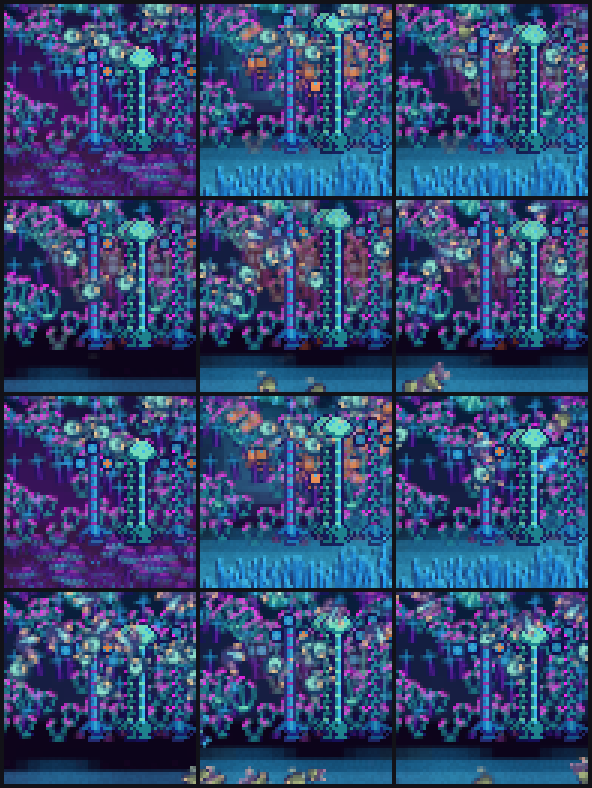

# Workstream Z — the coupled grazed opening: burn in with an ordinary roster, remove it, found again

Evidence, not a decision. **Nothing here changes §11, `producer.initial_fraction` or any
equation, no `WorldConfig` field was added, and no uniform total is proposed for §11.** §7
states what Wrysk would be choosing and does not choose it.

**Brief**: [`design/handoffs/ecology-v1-grazed-opening-opus-2026-09-16.md`](../handoffs/ecology-v1-grazed-opening-opus-2026-09-16.md),
item 6 of the reconciled next steps in the
[round-4 result](ecology-v1-round4-results-2026-09-16.md), in Astra's words: conservation-
accounted snapshots of the full coupled field after an ordinary roster has produced the grazed
state, that burn-in population removed and an identical fresh roster founded, against the
status quo and the 48,000-tick plant-only opening. The measurement
[S](ecology-v1-precondition-2026-09-16.md) §7 named under "Neither".

**The comparison was pre-registered before a row existed**:
[`ecology-v1-grazed-opening-preregistration-2026-09-16.md`](ecology-v1-grazed-opening-preregistration-2026-09-16.md),
committed at `30dc055` — the three openings, the measures, both denominators and the reading
rule, all fixed ahead of the operator, the tests and the campaign. §5 below applies that rule
as written, including where it falls awkwardly.

**Answer in one line.** A coupled-grazed opening is the one opening of the three that is
**already at the grazed standing crop**: it opens at ΣP 204–256 against a late-window standing
crop of 222–230, moves by at most 13 % of its own opening over the first simulated hour
(−12.9 % to +9.4 %) against the status quo's **+117 %** and the plant-only opening's **−40 %**,
gives every grazer founder a brood at tick 3,001,
doubles the surviving founder lineages, and **loses no seed's herbivore guild** — at a cost the
status quo does not pay in founder broods (39–46 against 43–56) and, at 180,000 ticks, in
terminal starved cells.

## 1. What was built

**Core — one operator, the mirror of the founding door.** `World::remove_all_animals()`
(`crates/cubarium-core/src/world/lifecycle.rs`) removes every organism and every neural entry,
leaves the field, water, weather, detritus, carrion and every pool untouched cell for cell, and
subtracts every removed body's `Organism::material()` — structure, reserve **and escrow**, the
same sum `mass_residual` adds over the population — from `external_material_in`, which is
therefore the world's *net* external material. That is the exact mirror of the `+=`
`found_roster` does, it needs no second counter, and because `World::from_state` re-derives its
residual baseline from the same net term it survives a snapshot round trip. A removed body is
**not** a death: no carrion, no `LifeEvent`, no `deaths_total`. It refuses by name, without
touching the world, when an extension holds state keyed to the bodies it would take out (hunter
members, quiet pauses, dormant apexes, paired gestations or parentage); an empty world is a
no-op that books zero.

The bodies' **stored energy** leaves with them and is booked nowhere, because it was not
dissipated and calling it heat would be a fabrication. The world's energy audit is measured over
an interval against a reading taken when recording opens, so a removal that happens *before* the
founding it precedes does not enter it; the number that left is carried out on the returned
bodies and reported in every row (`burn_in.energy_removed`, 55–82 units).

Tests first, from the brief's definitions (`crates/cubarium-core/tests/found_roster.rs`, six
new beside S's seven): nobody left and the material booked to the digit; every pool
byte-identical across the removal, with the clock, the weather and the water ledgers untouched;
the identical roster founded afterwards, genome for genome at the same cells with `born_tick` at
the removal tick; 2,000 ticks on with the invariants and both residuals intact; the empty-world
no-op; the named refusal that changes nothing.

**Search — `precondition --stage grazed`** (`crates/cubarium-search/src/precondition.rs`, plus
the `Precondition` command's arm in `main.rs`). Phase 1 runs each (candidate, seed) as the
**ordinary coupled world** to the last declared age, reading the field's settling every 6,000
ticks the way S's field stage does, and at every declared age empties a *clone*, founds the
identical fresh roster into it, saves that opening and decodes it straight back off disk. Phase
2 runs one arm per (candidate, seed, age): it re-runs its own burn-in rather than loading the
file — the measured chain stays snapshot-free, exactly as S's arms do — and its
`founding_state_hash` is then checked against the saved one.

**Age 0 is the status-quo arm and is neither burnt in nor emptied.** At tick 0 the burn-in
population *is* the fresh roster, and a remove-and-refound there would still change the world:
`Slots` hands a reused slot a higher generation, which enters `state_hash` and the
organism-keyed draws. Running it untouched is what makes it a reproduction of S's retained rows
rather than a near-miss.

Tests: `crates/cubarium-search/tests/precondition_measures.rs`, five new beside S's eight.
Totals: **`cargo test -p cubarium-core` 573 passed, 4 ignored**; **`cargo test -p
cubarium-search` 295 passed, 5 ignored**.

### 1.1 A declared deviation: the row shape

The brief asked for grazed rows "with the same row shape" as `--stage compare`, i.e.
`evaluate::Evaluation`. **That is not reachable from the files this workstream owns**, and the
pre-registration said so before the campaign ran (§8 there). `evaluate::run` is private, builds
its own world from a config and a seed, and cannot be entered with a world that has already been
burnt in and re-founded; the only public preconditioning entry, `evaluate::precondition`, is
plant-only and refuses a populated world; and `evaluate.rs` was owned by two other workstreams
this round and must not be touched. So the stage carries its own `GrazedRow`.

Every measure that already has a shared public definition **is** that definition —
`movement::FounderBroods`, `movement::CrossingCounter`, `movement::CensusKey`,
`metrics::guild_of`, `metrics::FORMS_POSSIBLE`, `evaluate::OpeningPoint`,
`plant_budget::PlantBudgetTracker` and the core's own plant record. What is new is the loop that
drives them — and §2.2 checks that loop against S's, measure by measure, rather than asserting
it. Measures only `Evaluation` carries (the spatial windows, the census, the margins, the
per-depleted-cell four-way reading) are **not reported** and no claim is made about them.

## 2. The reproduction checks, before anything was interpreted

1. **The status-quo arm is the status quo.** All 12 age-0 rows carry workstream S's retained
   age-0 `final_state_hash` **and** `final_ecology_hash`: **12 of 12**. S's rows were produced
   under schema 16 and the `half-space` pursuit rule of the time; arm 0 has no predator, so the
   schema-17 predicate change reaches nobody in these worlds and the hashes carry across
   unchanged. That is stated because it was a real risk, not because it turned out fine.
2. **The arm opens on the state the burn-in stage saved.** Every arm's `founding_state_hash`
   equals the hash the burn-in stage recorded by emptying and founding its own clone of the same
   age: **36 of 36**.
3. **The saved openings are the openings.** Every one of the 36 `.cube` files decodes back to
   the hash it was written under, and that hash is the founded opening itself: **36 of 36**.
4. **The common reference does not move.** For every (configuration, seed), all four ages'
   common counters watch the same cells as that pair's age-0 arm: **48 of 48**. The count itself
   varies by seed (1,079–1,136 of 1,280), which is the §11 seeding differing by seed, not the
   reference drifting with the opening.
5. **The books close.** Over all 48 arms the largest `|mass residual|` is **4.86e−10**, the
   largest `|water residual|` **6.26e−10**, and the core plant record's own closing identity
   **8.92e−12**, all against a 1e−9 acceptance. At the removal instant itself the largest
   `|mass residual|` is **2.29e−10**.

### 2.2 The new recorder against S's

Because `GrazedRow` is a second recorder, it is checked against S's `Evaluation` recorder on
every measure the two share, at age 0, on all 12 (configuration, seed) pairs:

| measure | agreement |
| --- | :-: |
| `final_population`, `final_forms_present`, `min_forms_present` | 12 / 12 each |
| `founder_lineages_alive`, `prey_births`, `prey_deaths` | 12 / 12 each |
| `mean_form_evenness`, `final_producer` (to 8 decimals) | 12 / 12 each |
| `crossings.depletions`, `crossings.cells_watched` | 12 / 12 each |
| `founder_broods`: `parents_by_form`, `broods_by_form`, `first_brood_tick_by_form` | 12 / 12 each |
| `guild_final` | 12 / 12 |
| plant-budget split: `total_crossings`, `with_withdrawal`, `ever_visited` | 12 / 12 each |

**204 of 204 exact.** The terminal starved-cell count is a third check: this workstream computes
it inside the runner against `World::new`'s tick-0 foliage, and S computed hers in a separate
script from the per-cell plant record; the status-quo row reads **11.2** (baseline) and **0.8**
(fast-leaf), which is S §4.2 cell for cell.

## 3. The three openings

Six training seeds, two configurations, arm 0, 180,000 ticks after founding, `sample_every` 600,
ledger and plant record on. Means over seeds; crossing counts are per-config totals over the six
seeds. Tables regenerate with
[`assets/ecology-v1-grazed-opening-tables.py`](assets/ecology-v1-grazed-opening-tables.py).

| config | opening | opening ΣP | CV | founders that bred, of 24 | broods | lineages alive | evenness | final pop | forms | late ΣP (absolute) | late ÷ opening |
| --- | --- | ---: | ---: | ---: | ---: | ---: | ---: | ---: | ---: | ---: | ---: |
| baseline | status quo | 107.2 | 0.388 | 10.5 | 42.7 | 4.7 | 0.438 | 40.0 | 2.3 | **247.7** | 2.31 |
| baseline | plant-only 48,000 | 358.3 | — | 23.7 | 67.3 | 11.0 | 0.697 | 46.2 | 3.0 | **224.7** | 0.63 |
| baseline | coupled-grazed 48,000 | 228.0 | 0.396 | 21.3 | 39.8 | 10.5 | 0.667 | 51.7 | 3.0 | **222.5** | 1.02 |
| baseline | coupled-grazed 96,000 | 234.8 | 0.327 | 21.8 | 39.3 | 10.8 | 0.678 | 48.8 | 3.0 | **225.6** | 0.98 |
| baseline | coupled-grazed 180,000 | 255.9 | 0.319 | 23.5 | 43.5 | 9.5 | 0.698 | 50.8 | 3.2 | **226.2** | 0.91 |
| fast-leaf | status quo | 107.2 | 0.388 | 14.8 | 56.0 | 7.3 | 0.635 | 62.3 | 3.0 | **226.2** | 2.11 |
| fast-leaf | plant-only 48,000 | 401.0 | — | 24.0 | 75.0 | 11.7 | 0.703 | 58.2 | 3.2 | **228.1** | 0.57 |
| fast-leaf | coupled-grazed 48,000 | 204.3 | 0.280 | 20.2 | 42.5 | 11.5 | 0.662 | 64.8 | 3.0 | **228.3** | 1.12 |
| fast-leaf | coupled-grazed 96,000 | 221.1 | 0.184 | 22.3 | 45.5 | 13.2 | 0.689 | 64.3 | 3.2 | **230.0** | 1.04 |
| fast-leaf | coupled-grazed 180,000 | 229.2 | 0.162 | 23.3 | 46.3 | 12.7 | 0.698 | 65.3 | 3.5 | **229.2** | 1.00 |

**Read the last two columns together, in that order.** The absolute column is the comparable
one: every arm of every opening ends between **222 and 248**, which is S §5's grazed standing
crop measured a second way and from a third direction. The ratio column is the same number
divided by a denominator that differs by a factor of **3.7** between the status quo and the
plant-only opening — 2.31 and 0.63 are the *same* late foliage. That is the denominator problem
S §7 raised, and it is why the coupled-grazed ratios sit at 0.91–1.12: not because those worlds
behave differently late, but because they are the only openings whose denominator is already the
answer.

**The opening is also markedly more even.** The coupled-grazed CV falls with burn-in age
(0.396 → 0.319 at baseline, 0.280 → 0.162 at fast-leaf) where the plant-only prefix *raised* it
(0.388 → 0.507–0.552, S §3). A grazed field is smoother than both the §11 seeding and the
ungrazed one.

### 3.1 The founders, by kind

| config | opening | lantern (10) | sail (5) | mossback (4) | skimmer (5) | first brood, lantern | first brood, sail |
| --- | --- | ---: | ---: | ---: | ---: | ---: | ---: |
| baseline | status quo | **0.3** | **1.3** | 3.8 | 5.0 | 21,044 (2/6) | 14,707 (5/6) |
| baseline | plant-only 48,000 | 10.0 | 5.0 | 4.0 | 4.7 | 3,001 (6/6) | 3,001 (6/6) |
| baseline | coupled-grazed 48,000 | 9.7 | 5.0 | 3.8 | **2.8** | 3,001 (6/6) | 3,001 (6/6) |
| baseline | coupled-grazed 96,000 | 10.0 | 5.0 | 3.5 | **3.3** | 3,001 (6/6) | 3,001 (6/6) |
| baseline | coupled-grazed 180,000 | 10.0 | 5.0 | 3.8 | 4.7 | 3,001 (6/6) | 3,001 (6/6) |
| fast-leaf | status quo | **3.0** | **3.2** | 3.8 | 4.8 | 12,259 (6/6) | 11,858 (6/6) |
| fast-leaf | plant-only 48,000 | 10.0 | 5.0 | 4.0 | 5.0 | 3,001 (6/6) | 3,001 (6/6) |
| fast-leaf | coupled-grazed 48,000 | 10.0 | 5.0 | 3.8 | **1.3** | 3,001 (6/6) | 3,001 (6/6) |
| fast-leaf | coupled-grazed 96,000 | 10.0 | 5.0 | 3.8 | **3.5** | 3,001 (6/6) | 3,001 (6/6) |
| fast-leaf | coupled-grazed 180,000 | 10.0 | 5.0 | 3.7 | 4.7 | 3,001 (6/6) | 3,001 (6/6) |

The grazer and glider gains are S's, reproduced from a different opening: 0.3 → 10.0 and
1.3 → 5.0 at baseline, first brood at the 3,001-tick floor in every seed. **The cost is the
skimmer**, and it is new. The floor-algae feeder drops from 5.0 of 5 to **1.3–3.5** at the two
shorter ages and recovers to 4.7 only at 180,000. The burn-in population grazed the wet band
down and the fresh skimmers open into a thinner one; the frames in §6 show that band bare in
exactly those panels. Nothing separates "less algae" from "a different nutrient history in the
wet band" here, and the workstream does not claim to.

### 3.2 Depletion, on both references

| config | opening | crossings (own ref) | with withdrawal | without | ever visited | crossings (§11 ref) | terminal below ¼ §11 | below ½ §11 | median P_final ÷ P_§11 |
| --- | --- | ---: | ---: | ---: | ---: | ---: | ---: | ---: | ---: |
| baseline | status quo | 68 | **0** | 68 | 41 | 68 | **11.2** | 13.3 | 2.27 |
| baseline | plant-only 48,000 | 77 | 2 | 75 | 45 | — | **13.0** | 14.8 | 2.02 |
| baseline | coupled-grazed 48,000 | 62 | **0** | 62 | 23 | 72 | **10.8** | 13.3 | 2.02 |
| baseline | coupled-grazed 96,000 | 80 | 3 | 77 | 28 | 90 | **14.3** | 15.7 | 2.02 |
| baseline | coupled-grazed 180,000 | 119 | 39 | 80 | 73 | 123 | **19.5** | 21.0 | 2.01 |
| fast-leaf | status quo | 5 | **0** | 5 | 1 | 5 | **0.8** | 1.3 | 2.07 |
| fast-leaf | plant-only 48,000 | 17 | 2 | 15 | 13 | — | **2.5** | 3.7 | 2.06 |
| fast-leaf | coupled-grazed 48,000 | 12 | **0** | 12 | 6 | 13 | **2.2** | 3.0 | 2.06 |
| fast-leaf | coupled-grazed 96,000 | 15 | 2 | 13 | 7 | 18 | **1.8** | 2.5 | 2.07 |
| fast-leaf | coupled-grazed 180,000 | 19 | 5 | 14 | 11 | 24 | **3.0** | 3.2 | 2.07 |

The bold column is the comparable one. At **48,000** the coupled-grazed opening ends with
*fewer* starved cells than the status quo at baseline (10.8 against 11.2) and with 2.2 against
0.8 at fast-leaf; the plant-only opening of the same age ends with 13.0 and 2.5. At 180,000 the
coupled-grazed opening costs 19.5 and 3.0 — against the plant-only prefix's **82.7 and 34.5** at
the same age (S §4.2). **A coupled burn-in does not strip the over-seeded cells the way a
plant-only one does**, which is S §4.2's mechanism confirmed from the other side: the animals'
recycling was present throughout the burn-in. What it does cost is already visible *at the
founding*: 0.3 / 3.7 / 11.2 cells (baseline) and 0.0 / 0.7 / 0.8 (fast-leaf) are below a quarter
of their §11 seeding before the fresh roster is placed.

The own-reference column is reported for completeness and is **not** comparable across openings:
it reads each cell against that arm's own opening, which is the quantity that moves.

### 3.3 The burn-in, accounted

| config | age | burn-in pop | by guild (herb/detr/mixed) | of the 24 founders, alive | material removed | energy removed | ΣP at founding | below ¼ §11 at founding |
| --- | ---: | ---: | --- | ---: | ---: | ---: | ---: | ---: |
| baseline | 48,000 | 34.3 | 27.8 / 6.0 / 0.5 | 1.7 | 42.3 | 56 | 228.0 | 0.3 |
| baseline | 96,000 | 45.3 | 30.7 / 11.3 / 3.3 | 1.3 | 52.3 | 59 | 234.8 | 3.7 |
| baseline | 180,000 | 40.0 | 24.8 / 13.0 / 2.2 | 0.0 | 43.2 | 55 | 255.9 | 11.2 |
| fast-leaf | 48,000 | 54.0 | 45.7 / 7.8 / 0.5 | 5.8 | 59.9 | 72 | 204.3 | 0.0 |
| fast-leaf | 96,000 | 60.3 | 50.3 / 9.7 / 0.3 | 3.2 | 67.1 | 74 | 221.1 | 0.7 |
| fast-leaf | 180,000 | 62.3 | 48.8 / 13.3 / 0.2 | 0.0 | 68.0 | 82 | 229.2 | 0.8 |

For scale, the roster the door founds is ~39–40 units of material, so a burn-in removal exports
roughly one to 1.7 rosters' worth. By 180,000 ticks **no original founder is left alive** in
either configuration, so "the burn-in population" at that age is entirely descendants.

## 4. The first simulated hour after founding

ΣP over the six seeds, from each arm's own recorded trajectory.

| config | opening | at founding | +6,000 | +18,000 | +36,000 | +72,000 | minimum | at tick | move over the hour |
| --- | --- | ---: | ---: | ---: | ---: | ---: | ---: | ---: | ---: |
| baseline | status quo | 107.2 | 131.5 | 184.2 | 214.0 | 232.7 | 107.2 | 0 | **+125.5** |
| baseline | plant-only 48,000 | 358.3 | 243.4 | 196.7 | 207.3 | 216.6 | 191.8 | 9,700 | **−141.7** |
| baseline | coupled-grazed 48,000 | 228.0 | 211.1 | 202.1 | 207.5 | 215.1 | 195.9 | 6,400 | **−12.9** |
| baseline | coupled-grazed 96,000 | 234.8 | 218.7 | 210.1 | 215.3 | 216.7 | 207.8 | 15,600 | **−18.1** |
| baseline | coupled-grazed 180,000 | 255.9 | 229.2 | 216.4 | 220.3 | 222.9 | 214.7 | 16,100 | **−33.0** |
| fast-leaf | status quo | 107.2 | 128.0 | 188.4 | 197.6 | 215.7 | 107.2 | 0 | **+108.5** |
| fast-leaf | plant-only 48,000 | 401.0 | 273.5 | 207.0 | 216.5 | 224.7 | 198.8 | 9,900 | **−176.3** |
| fast-leaf | coupled-grazed 48,000 | 204.3 | 217.1 | 212.5 | 217.0 | 223.6 | 204.3 | 0 | **+19.3** |
| fast-leaf | coupled-grazed 96,000 | 221.1 | 231.9 | 220.0 | 223.8 | 224.2 | 217.7 | 15,300 | **+3.1** |
| fast-leaf | coupled-grazed 180,000 | 229.2 | 236.5 | 224.2 | 224.6 | 226.7 | 222.4 | 36,000 | **−2.5** |

**This is the result.** S §5's transient is not inverted here; it is *removed*. The status quo
climbs 108–126 units over the hour and the plant-only opening falls 142–176; a coupled-grazed
opening moves by 2.5–33 units, and at `fast-leaf` 180,000 by **2.5 units on a total of 229**.
The deepest excursion below the opening, as a fraction of that opening, is **16.1 %** (baseline
180,000, 255.9 → 214.7) and at fast-leaf never more than 3.0 % — against the plant-only
opening's **46.5 %** and **50.4 %**.

Exact plant flows over that hour, summed over every cell, are in the regenerated table: gross
income 2,035–2,330 and foliage out 680–862 across all ten arms, i.e. the *flows* barely differ
between openings. What differs is the stock they start from.

## 5. The reading rule, applied as written

The rule was fixed in the pre-registration §6 before any row existed. Clause 1: every grazer
founder breeds, founder lineages alive ≥ 1.5× the status quo, evenness up. Clause 2: the opening
is within 20 % of the grazed standing crop that arm converges to. Clause 3: terminal starved
cells on the common §11 reference within noise of the status quo, where "noise" is the status
quo's own across-seed standard deviation.

**baseline** — status quo: lineages 4.7, evenness 0.438, terminal below ¼ §11 11.2 (sd 11.09)

| age | grazer founders bred (of 10) | lineages ÷ status quo | evenness up | opening ÷ late gap | paired Δ starved vs sd | verdict |
| ---: | ---: | ---: | :-: | ---: | ---: | --- |
| 48,000 | 9.7 | 2.25× | yes | 2.5 % | −0.3 vs 11.09 | **not** (1 ✗, 2 ✓, 3 ✓) |
| 96,000 | 10.0 | 2.32× | yes | 4.1 % | +3.2 vs 11.09 | **better target** |
| 180,000 | 10.0 | 2.04× | yes | 13.1 % | +8.3 vs 11.09 | **better target** |

**fast-leaf** (the selected ecology) — status quo: lineages 7.3, evenness 0.635, terminal below
¼ §11 0.8 (sd 1.33)

| age | grazer founders bred (of 10) | lineages ÷ status quo | evenness up | opening ÷ late gap | paired Δ starved vs sd | verdict |
| ---: | ---: | ---: | :-: | ---: | ---: | --- |
| 48,000 | 10.0 | 1.57× | yes | 10.5 % | +1.3 vs 1.33 | **not** (1 ✓, 2 ✓, 3 ✗) |
| 96,000 | 10.0 | 1.80× | yes | 3.9 % | +1.0 vs 1.33 | **better target** |
| 180,000 | 10.0 | 1.73× | yes | 0.0 % | +2.2 vs 1.33 | **not** (1 ✓, 2 ✓, 3 ✗) |

**So, per configuration and by the rule as written: `fast-leaf` reads "better target" at
96,000 and "not" at 48,000 and 180,000; `baseline` reads "better target" at 96,000 and 180,000
and "not" at 48,000.** The one age both configurations agree on is **96,000**.

Three things about that verdict have to be said plainly rather than smoothed over, because the
rule was pre-registered and its weaknesses are now visible:

- **Clause 1 fails at baseline 48,000 on 9.7 of 10**, which is *one grazer founder in one seed
  of six*. The clause was written as an equality ("every grazer founder breeds") and it is
  applied as one. It is a near-miss, not a failure of the opening, and calling it a failure is
  what pre-registration costs.
- **Clause 3's denominator is not a noise estimate at baseline.** The status quo's across-seed
  sd of 11.09 is produced by seed 1006, whose herbivore guild collapses entirely
  (`guild_final [0, 17, 11]`, 32 starved cells against 3–14 elsewhere). A tolerance built from a
  collapse is wide enough to admit almost anything, so baseline's clause-3 passes carry much
  less weight than fast-leaf's clause-3 failures, where sd is 1.33 and the paired excesses of
  +1.3 and +2.2 cells are real but tiny in absolute terms (0.8 → 2.2 and 0.8 → 3.0 cells of
  ~1,106 watched).
- **The rule has no clause for the two costs the campaign actually found**: the founder broods
  (39.3–46.3 against the status quo's 42.7–56.0, and paired 0–1 better of 6 in every arm) and
  the skimmer founders (§3.1). Neither would change any verdict above; both are stated because
  the rule not asking about them is not the same as their not existing.

**One result the rule does not score and should be recorded anyway:** the baseline status quo
loses seed 1006's entire herbivore guild, and **no coupled-grazed arm at any age in either
configuration loses a herbivore guild** (0 of 36 arms have `guild_final[0] == 0`). That is the
same gate S's preconditioned arms passed and the status quo failed.

### 5.1 Paired against the status-quo arm of the same seed

| config | age | lineages better/worse | broods | evenness | starved cells fewer/more |
| --- | ---: | :-: | :-: | :-: | :-: |
| baseline | 48,000 | 6 / 0 | 1 / 4 | 6 / 0 | 1 / 4 |
| baseline | 96,000 | 6 / 0 | 1 / 5 | 6 / 0 | 1 / 4 |
| baseline | 180,000 | 5 / 0 | 3 / 3 | 6 / 0 | 0 / 6 |
| fast-leaf | 48,000 | 6 / 0 | 0 / 6 | 5 / 1 | 0 / 3 |
| fast-leaf | 96,000 | 6 / 0 | 0 / 6 | 6 / 0 | 0 / 5 |
| fast-leaf | 180,000 | 6 / 0 | 1 / 5 | 6 / 0 | 0 / 5 |

Lineages and evenness improve in nearly every seed; **founder broods fall in nearly every
seed**. Those are not in tension: fewer founder broods with more surviving lineages and a larger
final population (§3) means the population is carried by descendants rather than by the founders
breeding repeatedly.

## 6. The frames



[`assets/ecology-v1-grazed-opening-2026-09-16.png`](assets/ecology-v1-grazed-opening-2026-09-16.png)
(154 KB). Three columns — status quo, plant-only 48,000, coupled-grazed 48,000. Four rows, top
to bottom: baseline at the founding, baseline one simulated hour later, fast-leaf at the
founding, fast-leaf one hour later. Seed 1001, the **Front** face, every panel drawn through the
real `ArtPresenter` with the shipped `assets/atelier` at the real 64 × 64 and then magnified ×3
with no filtering. Nothing is an overlay and nothing is synthetic. The renderer is
[`assets/ecology-v1-grazed-opening-frames.rs`](assets/ecology-v1-grazed-opening-frames.rs),
which lives under `assets/` because this workstream does not own `crates/cubarium/`; it is
copied into that crate's `examples/` to run and removed again, and the crate is unchanged (its
header says how). The panels' own numbers, seed 1001: ΣP 106.5 / 353.6 / 189.0 at the founding
and 198.4 / 210.7 / 209.4 an hour later (baseline); 106.5 / 390.7 / 197.1 and 206.0 / 222.3 /
221.5 (fast-leaf).

What the picture shows, plainly:

- **At the founding**, column 1 has no reed bed at all in the wet lower band — a mauve mat and
  bare water — and the sparsest canopy on the sheet. Columns 2 and 3 both carry a standing reed
  bed, and **column 3's is visibly the thinner of the two**: shorter strokes with gaps between
  them where column 2's is a solid wall. The canopy above follows the same order. The
  coupled-grazed opening looks like what it is, a *grazed* version of the plant-only one.
- **One hour later**, the three panels are much more alike than the three above them. The reed
  bed has been eaten off in **every** column, including column 3's, and the founders are visible
  as small bodies on the water band in columns 2 and 3.
- That last point is a caveat the totals hide: ΣP is nearly stationary in column 3 (189.0 →
  209.4, up) while the *spatial* distribution is not — the wet band's standing reeds go in every
  arm and the growth appears in the canopy. "The opening does not brown" is a statement about
  the whole-field total, not about every band of the picture.

**The physical cube was not inspected.** These are PNGs rendered headlessly from the presenter;
nothing was sent to the display and the running `cubarium` was not touched.

## 7. What Wrysk would be choosing — stated, not decided

- **Leave §11.** Nothing about the world changes. The opening is thin and uniform (ΣP 107,
  CV 0.39) and greens by 108–126 units over the first hour; ~11 and ~1 cells end starved; but at
  baseline only 0.3 of 10 grazer founders ever breed, 4.7 of 24 founder lineages survive, the
  display ends with 2.3 of 4 forms, and one seed in six loses its herbivores altogether.
- **Adopt a coupled-grazed opening at a declared age.** The opening is green, smooth and
  *already at the grazed standing crop*: it moves by 2.5–33 units over the first hour instead of
  108–176 — at most 13 % of its own opening against +117 % and −40 % — every grazer founder
  breeds at the 3,001-tick floor, 9.5–13.2 lineages survive with
  3.0–3.5 forms and evenness 0.66–0.70, no seed loses its herbivore guild, and the terminal
  starved-cell cost at 48,000–96,000 is 1.8–14.3 cells against the status quo's 0.8–11.2. The
  costs are (a) **the computation**: 40–150 simulated minutes of a *coupled* world before a
  fresh world can be shown — measured from the burn-in runs themselves at **6,667 ticks/s on
  one core** under this campaign's eight-way load, i.e. ~7 s at 48,000 ticks, ~14 s at 96,000
  and ~27 s at 180,000. That is only about **1.3×** the plant-only prefix's cost (S's field
  stage ran 12 × 180,000 plant-only ticks over 8 workers in 41.8 s, ≈ 8,600 ticks/s per core),
  so preconditioning coupled rather than plant-only is not a materially more expensive option;
  (b) **the skimmer**, whose founders drop to 1.3–3.5 of 5 at the shorter ages; (c) **founder
  broods**, down in nearly every paired seed; and (d) the opening is a *procedure*, not a
  seeding rule — §11 is untouched and a fresh world is no longer one constructor call.
  On the measured evidence the age both configurations agree on is **96,000**; 48,000 costs
  the skimmer most and 180,000 costs the starved cells most.
- **Neither.** The measurement supports a third reading too. Every opening converges to the same
  222–248 within the hour, and a coupled-grazed opening's whole advantage is that it *starts*
  there. If what §11 wants is the grazed standing crop, this campaign has now measured it three
  independent ways and always gets 215–248 — but it also shows (§6) that the *spatial* pattern
  keeps moving whatever the total does, so a §11 change that reproduced the grazed **total**
  would still not reproduce the grazed **field**. The over- and under-seeding M exposed would
  come back. On this evidence a uniform total remains the wrong instrument, which is exactly
  what Astra's "no uniform total written into §11" says.

**This note does not choose**, and it changes no equation.

## 8. What this does not establish

- **Three burn-in ages, not an optimisation.** Nothing was run between 0 and 48,000, or between
  48,000 and 96,000. The age at which the skimmer recovers and the age at which the starved-cell
  cost starts to bite are both somewhere inside those gaps and are not located here.
- **Six training seeds, two configurations, one price, arm 0.** Nothing about the held-out
  seeds, the other four ladder prices, arms 1 and 2, or any configuration outside `baseline` and
  `fast-leaf`.
- **The burn-in population is one particular population.** It is the ordinary roster and its
  descendants under this configuration and seed; the field it leaves is the field *that*
  population grazed, not a general grazed field. By 180,000 ticks none of the original founders
  is alive in it.
- **Removing the burn-in population removes an ongoing regime, not only a stock.** What the
  fresh roster meets is the nutrient and litter history the burn-in already deposited; the
  faeces, carcasses and respiration that would have followed are gone with the bodies. That is
  S §4.2's mechanism read from the other side and it is not separated here from the standing
  crop itself.
- **The removed bodies' energy is booked nowhere.** It is reported (55–82 units) and the world's
  energy audit is interval-relative to the founding, so nothing is hidden — but a world that has
  been emptied is not energy-closed against its own creation, and no claim is made that it is.
- **No age is an equilibrium and none is called one.** The coupled burn-in's own settling
  readings are in `burn-in.jsonl`; the campaign did not read them as convergence.
- **`GrazedRow` is not `Evaluation`.** The spatial windows, the variety census, the per-body
  margins and the per-depleted-cell four-way reading were not measured for any coupled-grazed
  arm, and nothing is claimed about them. §2.2 is the evidence that what *was* measured agrees
  with S's recorder.
- **The frames are single stills** through a freshly-observed presenter, one seed and one face.
  They are not a video and carry no animation-phase continuity.
- **Nothing was measured about whether such a world is more or less interesting to watch over
  hours.** The comparison stops at 180,000 ticks after founding.

## 9. The campaign

```bash
# the whole grazed stage: 12 coupled burn-ins with three saved openings each,
# then 48 arms (12 status-quo + 36 coupled-grazed) of 180,000 ticks
cubarium-search precondition --stage grazed --candidates baseline,fast-leaf \
  --seed-set training --seeds 6 --ages 0,48000,96000,180000 \
  --ticks 180000 --sample-every 600 --workers 8 --wall-seconds 480 \
  --out runs/ecology-v1-grazed-opening
```

| stage | trials | simulated ticks | wall | throughput | peak RSS | skipped | failed |
| --- | ---: | ---: | ---: | ---: | ---: | ---: | ---: |
| grazed (both phases) | 48 arms + 12 burn-ins | 14,688,000 | 304.2 s | 48,285 ticks/s aggregate | 35 MiB | 0 | 0 |
| frames | 6 worlds | 480,000 | — | single-threaded | — | — | — |

Per-arm cost, which is what a live adoption would pay: a coupled burn-in runs at **6,667
ticks/s on one core** under the campaign's eight-way load (27.0 s for 180,000 ticks), and a
whole arm — burn-in plus the 180,000-tick horizon with the ledger and the plant record on —
takes 26.5 s at age 0, 34.2 s at 48,000, 43.5 s at 96,000 and 57.8 s at 180,000.

**5.1 wall minutes**, inside the brief's eight. `runs/ecology-v1-grazed-opening/` is **6.5 MiB**
against the brief's 80: 1.7 MiB of `grazed.jsonl` (each row carries the opening-hour trajectory
and the aggregate measures, not the per-crossing rows), 4.4 MiB of 36 saved openings at ~125 KiB
each, 408 KiB of `burn-in.jsonl`, and the two exported configs. Build `078594b`, pinned through
`CUBARIUM_SEARCH_BUILD` and run from a release binary copied out of the shared target.

## 10. Decisions this workstream made, and why

| decision | why |
| --- | --- |
| the removal books into `external_material_in` as a **negative**, rather than a new counter | the brief asked for "an external-out counter the conservation identity sees, the mirror of what `found_roster` books in", and the mirror of `+=` is `-=`; a new `WorldState` field would have been "something else in core", which the brief forbids, and `found_neural_animal`'s unwind already sets the precedent in the same file. `external_material_in` is only required to be finite, and `from_state` re-derives its baseline from the same net term, so a snapshot of an emptied world still reads zero |
| the operator books `Organism::material()`, not `structure + reserve` | the brief says `structure + reserve`, but `mass_residual` sums `material()` over the population, which includes a gestating body's escrow. Booking the brief's literal sum would have left the escrow of any pregnant body unaccounted and broken the identity the same deliverable demands |
| the removed bodies' energy is booked nowhere and reported instead | it was not dissipated, so `heat_out_total` would be a fabrication; the energy audit is interval-relative to the founding, so a removal before it does not enter the measurement at all. Reporting the number is what keeps that a statement rather than a silence |
| the operator **refuses** when an extension holds bodies | it has no accounted policy for a hunter's carried carcass (which is inside the material identity), an open quiet pause, a dormant apex or a paired gestation. A silent drop would corrupt exactly the ledger the extension exists to keep; arm 0 has none of them, so the refusal costs this campaign nothing and protects the next caller |
| the operator returns the removed bodies | the search side needs the composition, the material and the energy, and a `Vec<Organism>` gives all three without a new public type — which would have meant editing `world/mod.rs`, i.e. something else in core |
| age 0 is run through the **constructor**, not through remove-and-refound | at tick 0 the two are the same cohort, but `Slots` gives a reused slot a higher generation, which enters `state_hash` *and* the organism-keyed draws; a remove-and-refound age-0 arm would have diverged from S's rows for a reason that has nothing to do with the opening. Running it untouched is what makes the 12-of-12 reproduction mean what it says |
| the arm re-runs its own burn-in instead of loading the saved opening | it keeps the measured chain snapshot-free, exactly as S's arms are, and turns the saved states into a *check* (36 of 36) rather than a dependency. It costs 3.9 M extra ticks, which the wall budget had room for |
| the grazed stage carries `GrazedRow`, not `Evaluation` | forced, and declared before the campaign ran: `evaluate::run` is private, builds its own world, cannot be entered mid-world, and belongs to two other workstreams this round. §2.2 is the price paid for it — a 204-of-204 agreement check against S's recorder, which the `Evaluation` shape would not have needed |
| the row drops the per-crossing rows and the all-cell table from the plant-budget summary | 48 arms of them is the 28 MiB S's `compare.jsonl` cost, and no claim in this note needs them; the aggregate split is carried in full |
| the crossings are counted **twice**, on the arm's own reference and on a fixed §11 one | the own-reference count moves with the opening, so reporting only it would have made the verdict an artefact of the counter. S had to add the common reference in a post-hoc script; here it is a second counter inside the run, which also makes it testable |
| the reading rule was applied exactly as pre-registered, including where it reads badly | §5's three caveats are the honest output of having fixed the rule first. Rewriting clause 1 to "9.7 is close enough" or clause 3's tolerance to something narrower after seeing the numbers would have destroyed the only thing pre-registration buys |
