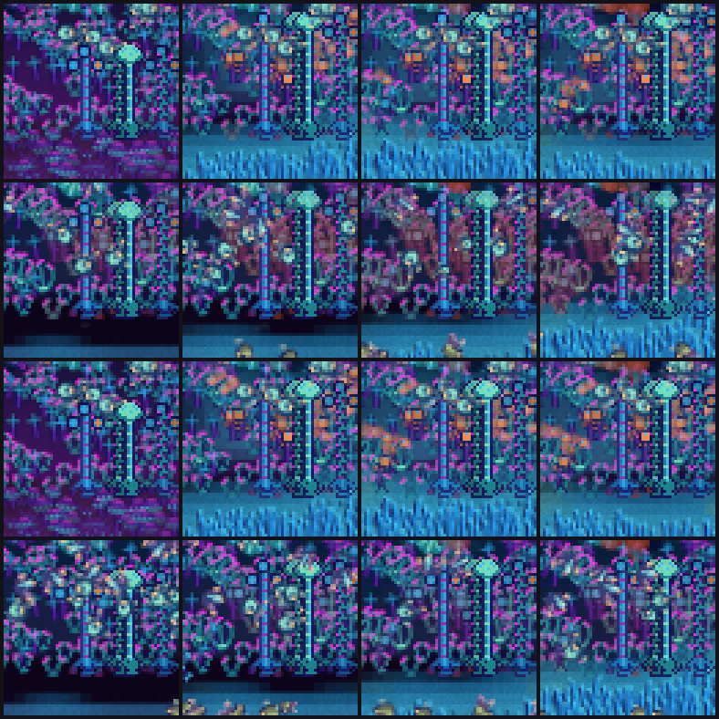

# Workstream S — a fixed-age preconditioned opening, measured against the status quo

> **Qualifications after Astra's round-4 review.** "No age removes the
> crossings" is "no *tested* age" (0, 48,000, 96,000, 180,000). The prefix did
> not "only add foliage": it evolved the whole coupled plant field (wood,
> reserve, nutrient) and exposed founders to a larger downward transient
> (baseline opens at ΣP 358 and falls to 192 in 9,700 ticks), so the 48,000
> founder benefit is "this preconditioned opening gives foliage feeders an
> immediate brood", not "a stationary opening fixes the founders"; the diet
> split makes food availability the leading explanation without separating
> opening stock, nutrient history, plant reserve and the transient. "The
> animals' recycling keeps the over-seeded cells alive" is measured as "animal
> presence has a net preserving effect, consistent with recycling"; removing
> the animals also removed grazing, carcasses, movement and their spatial
> history. And ΣP 215–230 is a grazed *total*, not an initialiser: a uniform
> `initial_fraction` reproducing it would recreate the local over- and
> under-seeding M exposed. The next comparison Astra names: conservation-
> accounted snapshots of the full coupled field after an ordinary roster has
> produced the grazed state, that burn-in population removed, an identical
> fresh roster founded — against status quo and the 48,000 plant-only opening.

Evidence, not a decision. **Nothing here changes §11, `producer.initial_fraction` or any
equation**, and no `WorldConfig` field was added. §8's options belong to Wrysk; §7 states what
he would be choosing and does not choose it.

**Brief**: [`design/handoffs/ecology-v1-precondition-opus-2026-09-16.md`](../handoffs/ecology-v1-precondition-opus-2026-09-16.md),
item 4 of the reconciled next steps in the
[round-3 result](ecology-v1-round3-results-2026-09-16.md), from Astra's
[round-3 review](ecology-v1-round3-review-2026-09-16.md) (P2 on M). It follows
[workstream M](ecology-v1-plant-budget-2026-09-16.md) §9, which named this task and did not
launch it.

**Build** `5d3941c` (`CUBARIUM_SEARCH_BUILD=5d3941c`), branch
`worktree-agent-ad81ca38a7cf85dab`, on top of `15e13c8`.

**Answer in one line.** A plant-only prefix does **not** make the ungrazed crossings vanish at
any age tested — they rise monotonically with age on the arm's own reference *and* on a common
one — but it transforms the founders' outcomes: at the status quo only **0.3 of 10** lantern
grazer founders ever complete a brood, and with a 48,000-tick prefix **all 10** do, in every
seed, at the earliest tick the drives allow.

## 1. What was built

**Core — one door.** `World::found_roster` (`crates/cubarium-core/src/world/lifecycle.rs`)
performs the ordinary founding — the same roster `World::new` places for this world's config and
seed — on a world that has already run, at whatever tick it has reached. The constructor's
founder loop was factored into two private helpers (`roster_keys`, `founder_body`) that both
paths now share, so the door cannot drift from the constructor. `born_tick` is the only thing
that follows the clock. The roster is read from the world's own config, so a caller that emptied
it to run plants-only must write it back before founding — which is also what makes the founded
world's config, and therefore its `state_hash`, the ordinary one.

Tests first, from the brief's definitions (`crates/cubarium-core/tests/found_roster.rs`,
7 tests): founding into a fresh tick-0 world reproduces `World::new` by `state_hash` on three
seeds and field for field on every founder; a 1,000-tick plant-only prefix places the same
genomes at the same positions with `born_tick` at the prefix; the world steps on and keeps its
invariants; `structure + reserve` is booked into `external_material_in` exactly; and it refuses
by name — **animals already present**, and **a config that declares no roster** — leaving the
world untouched either way. The second refusal is this workstream's addition and is there
because a caller that cleared the roster and forgot to restore it would otherwise get a silent
empty founding reported as a 24-founder arm.

**Search — the operator and the arms** (`crates/cubarium-search/src/precondition.rs`, plus
`RunOptions::precondition` and a relative recording origin in `evaluate.rs`):

- `precondition --stage field` builds each (candidate, seed) with the roster emptied, advances
  the ordinary §4 dynamics with nothing eating, saves the whole field at every declared age,
  and emits a reading every 6,000 ticks: moving-window changes in total **and per-cell** `P`,
  `W`, `Q`, `N`, the exact plant income and loss, the depletion crossings, and the foliage
  spread. The window is the same 6,000 ticks M's crossing budgets use, and a reading taken
  before the run is that old reports its **actual** window length rather than pretending.
- `precondition --stage compare` founds the roster at each age through the door and runs the
  ordinary 180,000 ticks after it, arm 0, with the ledger, the plant record and the depletion
  split on. A preconditioned row also carries the whole-field trajectory of its first simulated
  hour and the `state_hash` of the instant it was founded.

The recorder's windows, horizon, late window and collapse tick are now measured from the tick
recording opened at rather than from world creation. On every status-quo run that tick is 0 and
nothing changes; the campaign's 12-of-12 hash reproduction below is the check on that claim.

Tests: `crates/cubarium-search/tests/precondition_measures.rs` (8) and five unit tests in the
module. Totals: **`cargo test -p cubarium-core` 524 passed, 4 ignored**;
**`cargo test -p cubarium-search` 230 passed, 3 ignored**.

## 2. The reproduction checks, before anything was interpreted

1. **The status-quo arm is the status quo.** All 12 age-0 rows carry workstream M's retained
   present-arm `final_state_hash` **and** `final_ecology_hash`: **12 of 12**. Those rows were
   founded *through the door*, into a world built with an empty roster — not around it — so
   this is the campaign's own check that `found_roster` is the constructor.
2. **The arm opens on the state the operator saved.** The `founding_state_hash` a comparison
   arm records inside `evaluate::run` equals the hash the field stage recorded by founding onto
   its own copy of the same age: **48 of 48**, at all four ages.
3. **The saved states are the states.** Every one of the 48 `.cube` files decodes back to the
   hash it was written under, and founding onto the decoded state reproduces the founding hash
   (`every_saved_state_is_the_state_it_claims_to_be`).
4. **The operator reproduces M's herbivore-absent arm exactly.** Crossings at tick 180,000,
   per seed: baseline 75, 50, 73, 69, 62, 53 (**382**) and fast-leaf 36, 31, 36, 22, 28, 27
   (**180**) — M's §5 table, cell for cell, from an independent runner.
5. **And M's opening distributions.** §11 seeding: ΣP 107.2, median 0.0985, p10 0.0419,
   p90 0.1445, CV 0.388 (M: 107.15 / 0.0987 / 0.0420 / 0.1441 / 0.389). Plant-only at 180,000:
   ΣP 389.9 and 449.2, CV 0.528 and 0.454 (M: 389.37 / 447.34, 0.528 / 0.455).
6. **The plant-only arm really is plant-only.** The largest exact consumer withdrawal in any
   window of any plant-only run is `0.0`, and the per-cell plant identity closes at worst
   **1.16e-11** against a 1e-9 acceptance.

## 3. How settled the field is at each age

Means over the six training seeds; the window is 6,000 ticks. Tables regenerate with
[`assets/ecology-v1-precondition-tables.py`](assets/ecology-v1-precondition-tables.py).

| config | age | ΣP | ΔΣP/ΣP | per-cell P | cells moving | ΔΣW/ΣW | ΔΣN/ΣN | crossings in window | cumulative |
| --- | ---: | ---: | ---: | ---: | ---: | ---: | ---: | ---: | ---: |
| baseline | 0 | 107.2 | — | — | — | — | — | 0 | 0 |
| baseline | 48,000 | 358.3 | +0.0565 | 0.0630 | 974 | +0.0489 | −0.1297 | 0.3 | 0.3 |
| baseline | 96,000 | 393.8 | **+0.0040** | 0.0289 | 811 | +0.0154 | −0.0185 | 2.2 | 7.8 |
| baseline | 180,000 | 389.9 | +0.0060 | 0.0359 | 875 | +0.0068 | −0.0178 | 5.8 | 63.7 |
| fast-leaf | 48,000 | 401.0 | +0.0297 | 0.0525 | 968 | +0.0343 | −0.0887 | 0.0 | 0.0 |
| fast-leaf | 96,000 | 438.8 | +0.0098 | 0.0338 | 813 | +0.0145 | −0.0225 | 0.2 | 1.3 |
| fast-leaf | 180,000 | 449.2 | +0.0141 | 0.0421 | 883 | +0.0063 | −0.0292 | 3.5 | 30.0 |

**It is an age, not an equilibrium, and the numbers say which.** The *total* foliage is nearly
flat by 96,000 — 0.4 % per ten simulated minutes, and 0.6 % at 180,000, i.e. it is no longer
converging, it is wandering inside a percent. The *cells* never stop: 811–883 of the ~1,110
watched cells still move by more than 1 % of what they hold in every window, and the per-cell
change rate `Σ|ΔP|/ΣP` sits at 0.029–0.042 and does not fall between 96,000 and 180,000. The
crossings are also still arriving — 5.8 per window at 180,000 — which is M's point that 271 of
382 crossings land after tick 120,000. Calling any of these ages an equilibrium would be a
claim this measurement refuses.

**The opening a founding meets**, over the watched cells:

| config | age | ΣP | median | p10 | p90 | CV | already below ¼ of its §11 seeding |
| --- | ---: | ---: | ---: | ---: | ---: | ---: | ---: |
| baseline | 0 | 107.2 | 0.0985 | 0.0419 | 0.1445 | 0.388 | 0.0 |
| baseline | 48,000 | 358.3 | 0.3455 | 0.0538 | 0.5298 | 0.552 | **0.3** |
| baseline | 96,000 | 393.8 | 0.4483 | 0.0643 | 0.5221 | 0.485 | **7.8** |
| baseline | 180,000 | 389.9 | 0.4454 | 0.0428 | 0.5275 | 0.528 | **63.5** |
| fast-leaf | 0 | 107.2 | 0.0985 | 0.0419 | 0.1445 | 0.388 | 0.0 |
| fast-leaf | 48,000 | 401.0 | 0.4229 | 0.0728 | 0.5620 | 0.507 | 0.0 |
| fast-leaf | 96,000 | 438.8 | 0.4628 | 0.1025 | 0.5610 | 0.426 | 1.3 |
| fast-leaf | 180,000 | 449.2 | 0.4623 | 0.0751 | 0.5740 | 0.454 | 30.0 |

The last column is the one that decides between the ages. A 48,000-tick prefix greens the field
(3.3–3.7× the seeded foliage, CV 0.39 → 0.51–0.55) **without yet having killed anything**: 0.3
cells of 1,110 are below a quarter of their §11 seeding. A 180,000-tick prefix greens it no
further and has stripped 63.5 of them.

## 4. The comparison

Six seeds, both configurations, arm 0, 180,000 ticks after founding. Crossing counts are
**per-config totals over the six seeds**; everything else is a mean.

| config | age | opening ΣP | crossings | with withdrawal | without | ever visited | founders that bred, of 24 | broods | final pop | forms | late foliage ÷ opening |
| --- | ---: | ---: | ---: | ---: | ---: | ---: | ---: | ---: | ---: | ---: | ---: |
| baseline | 0 | 107.2 | 68 | **0** | 68 | 41 | **10.5** | 42.7 | 40.0 | 2.3 | 2.31 |
| baseline | 48,000 | 358.3 | 77 | 2 | 75 | 45 | **23.7** | 67.3 | 46.2 | 3.0 | 0.62 |
| baseline | 96,000 | 393.8 | 169 | 3 | 166 | 74 | 24.0 | 74.0 | 48.7 | 3.0 | 0.56 |
| baseline | 180,000 | 389.9 | 582 | 122 | 460 | 258 | 23.8 | 75.0 | 46.7 | 3.2 | 0.55 |
| fast-leaf | 0 | 107.2 | 5 | **0** | 5 | 1 | **14.8** | 56.0 | 62.3 | 3.0 | 2.11 |
| fast-leaf | 48,000 | 401.0 | 17 | 2 | 15 | 13 | 24.0 | 75.0 | 58.2 | 3.2 | 0.57 |
| fast-leaf | 96,000 | 438.8 | 50 | 5 | 45 | 23 | 24.0 | 80.8 | 60.8 | 3.0 | 0.52 |
| fast-leaf | 180,000 | 449.2 | 287 | 93 | 194 | 138 | 24.0 | 83.7 | 61.3 | 3.3 | 0.50 |

Every arm founds the same 24 bodies; "founders that bred" is how many of them completed at
least one brood, which is the measure that separates the arms. The first brood arrives at tick
3,001 after founding in every arm — the floor the drives allow — but at the status quo only the
detritivore and skimmer founders reach it, which §4.1 breaks out.

### 4.1 The founders, by kind — the largest effect measured here

[`assets/ecology-v1-precondition-by-kind.py`](assets/ecology-v1-precondition-by-kind.py).
"Founders that bred" is `parents_by_form`: distinct founders of that form that produced at least
one birth. First-brood ticks are relative to the founding.

| config | age | lantern (10) | sail (5) | mossback (4) | skimmer (5) | first brood, lantern | first brood, sail |
| --- | ---: | ---: | ---: | ---: | ---: | ---: | ---: |
| baseline | 0 | **0.3** | **1.3** | 3.8 | 5.0 | 21,044 (2 of 6 seeds) | 14,707 (5 of 6) |
| baseline | 48,000 | **10.0** | **5.0** | 4.0 | 4.7 | 3,001 (6/6) | 3,001 (6/6) |
| baseline | 96,000 | 10.0 | 5.0 | 4.0 | 5.0 | 3,001 (6/6) | 3,001 (6/6) |
| baseline | 180,000 | 10.0 | 5.0 | 3.8 | 5.0 | 3,001 (6/6) | 3,001 (6/6) |
| fast-leaf | 0 | **3.0** | **3.2** | 3.8 | 4.8 | 12,259 (6/6) | 11,858 (6/6) |
| fast-leaf | 48,000 | 10.0 | 5.0 | 4.0 | 5.0 | 3,001 (6/6) | 3,001 (6/6) |
| fast-leaf | 96,000 | 10.0 | 5.0 | 4.0 | 5.0 | 3,001 (6/6) | 3,001 (6/6) |
| fast-leaf | 180,000 | 10.0 | 5.0 | 4.0 | 5.0 | 3,001 (6/6) | 3,001 (6/6) |

At the status quo the grazer founders — 10 of the 24, the largest kind in the roster — mostly
never reproduce at all: 0.3 of 10 at baseline, 3.0 of 10 at fast-leaf, and when one does it
takes 21,000 or 12,000 ticks to manage it. Into a preconditioned field every one of them breeds
at tick 3,001, which is the floor the drives allow.

**The split falls exactly along diet.** The two kinds that eat standing foliage — the grazer
(`diet` 0.85, 10 founders) and the glider (0.90, 5) — are the two that fail at the status quo
and the two that preconditioning fixes. The burrower (0.10, litter) sits at 3.8 of 4 and the
skimmer (0.60, the algae standing water grows on the floor) at 4.7–5.0 of 5 in **every** arm,
preconditioned or not. That is the control the result needs: a prefix that only added foliage
should move only the animals that eat foliage, and it does.

This is not one seed carrying a mean
([`assets/ecology-v1-precondition-paired.py`](assets/ecology-v1-precondition-paired.py),
paired against the age-0 arm of the same seed):

| measure | baseline 48,000 | baseline 96,000 | baseline 180,000 | fast-leaf 48,000 |
| --- | :-: | :-: | :-: | :-: |
| founder lineages alive | 6 better, 0 worse | 5 / 1 | 6 / 0 | 5 / 1 |
| completed broods | 6 / 0 | 6 / 0 | 6 / 0 | 6 / 0 |
| mean form evenness | 6 / 0 | 6 / 0 | 6 / 0 | 6 / 0 |
| crossings (own reference) | 1 / 5 | 1 / 5 | 0 / 6 | 0 / 4 |

Founder lineages alive at the horizon go 4.7 → 11.0 / 9.7 / 10.3 (baseline) and 7.3 → 11.7 /
11.2 / 10.2 (fast-leaf); mean form evenness 0.438 → ~0.69 and 0.635 → ~0.70. **One of the six
baseline status-quo seeds loses its herbivore guild entirely** — seed 1006's late-window
`guild_final` is `[0, 17, 11]`, zero herbivores — which is why baseline age 0 fails the declared
`guilds_intact` gate while all three preconditioned baseline arms pass it
([`assets/ecology-v1-precondition-gates.py`](assets/ecology-v1-precondition-gates.py)).

### 4.2 The crossings rise, and the counter's reference is why — but not only why

Two facts have to be separated.

**The reference moves.** The depletion counter reads each cell against its own foliage when
recording opened, which is the founding. A preconditioned arm opens 3.6× greener, so "fell below
a quarter of its opening" is a different question there. That alone would inflate the counts.

**But the crossings rise on a common reference too.** Re-reading every arm's terminal per-cell
foliage against the **§11 seeding** taken from the age-0 arm of the same (config, seed)
([`assets/ecology-v1-precondition-common-reference.py`](assets/ecology-v1-precondition-common-reference.py)):

| config | age | cells below ¼ of the §11 seeding at the horizon | below ½ | median P_final ÷ P_§11 | ΣP final |
| --- | ---: | ---: | ---: | ---: | ---: |
| baseline | 0 | **11.2** | 13.3 | 2.27 | 255.9 |
| baseline | 48,000 | **13.0** | 14.8 | 2.02 | 224.7 |
| baseline | 96,000 | 29.0 | 30.5 | 1.99 | 222.2 |
| baseline | 180,000 | **82.7** | 87.3 | 1.91 | 215.1 |
| fast-leaf | 0 | 0.8 | 1.3 | 2.07 | 229.2 |
| fast-leaf | 48,000 | 2.5 | 3.7 | 2.06 | 228.1 |
| fast-leaf | 96,000 | 8.0 | 8.2 | 2.05 | 227.1 |
| fast-leaf | 180,000 | 34.5 | 35.3 | 2.00 | 224.8 |

At age 48,000 a preconditioned world ends with essentially the same number of starved cells as
the status quo (13.0 against 11.2 at baseline, 2.5 against 0.8 at fast-leaf). At 180,000 it ends
with seven times as many — and 63.5 of those 82.7 were already stripped *before* the founding
(§3's last column). The prefix did not prevent the decline; past about 96,000 ticks it **caused
most of it**.

**The mechanism is M's own result read from the other side.** M §7 noted that removing the
founders removes their feces, carcasses and respiration, so the plant-only arm is a different
nutrient regime — median `N` at the crossing cells 0.12–0.19 without animals against 0.67–0.91
with them. This campaign measures the consequence: with animals present for the whole 180,000
ticks, 11.2 cells end below a quarter of their §11 seeding; with the animals absent for those
same 180,000 ticks, 63.5 do. **The over-seeded cells are kept alive by the animals' recycling.**
A long plant-only prefix runs the world in exactly the regime that kills them, and then hands
the founders the corpses.

**One genuine side result.** At age 180,000, 122 (baseline) and 93 (fast-leaf) crossings carry
exact consumer withdrawal, against **0 of 73** in M's status-quo arm. Into a field carrying 3.6×
the foliage, grazing really does deplete cells. M's "the depletion counter is not a grazing
signal" is a statement about the §11 opening, not about the counter.

## 5. The first simulated hour after founding

ΣP over the six seeds, from each arm's own recorded trajectory:

| config | age | at founding | +6,000 | +18,000 | +36,000 | +72,000 | minimum | at tick |
| --- | ---: | ---: | ---: | ---: | ---: | ---: | ---: | ---: |
| baseline | 0 | 107.2 | 131.5 | 184.2 | 214.0 | 232.7 | 107.2 | 0 |
| baseline | 48,000 | 358.3 | 243.4 | 196.7 | 207.3 | 216.6 | **191.8** | 9,700 |
| baseline | 96,000 | 393.8 | 259.4 | 197.8 | 209.7 | 214.8 | 195.7 | 12,200 |
| baseline | 180,000 | 389.9 | 250.7 | 190.8 | 203.1 | 213.6 | 188.4 | 13,100 |
| fast-leaf | 0 | 107.2 | 128.0 | 188.4 | 197.6 | 215.7 | 107.2 | 0 |
| fast-leaf | 48,000 | 401.0 | 273.5 | 207.0 | 216.5 | 224.7 | 198.8 | 9,900 |
| fast-leaf | 96,000 | 438.8 | 296.3 | 209.6 | 221.6 | 223.7 | 204.5 | 10,700 |
| fast-leaf | 180,000 | 449.2 | 298.5 | 207.8 | 216.4 | 226.0 | 201.6 | 11,300 |

**Neither opening is stationary, and every arm converges to the same place.** Whatever it opens
on, the world settles at ΣP ≈ 215–230 within the first hour — the standing crop of a *grazed*
field, which is roughly half the ungrazed 390–450 the operator produced. The status quo climbs
into it from below (107 → 233, +126 units). A preconditioned opening falls into it from above
(358 → 192 in eight simulated minutes, −166 units, then back to 217). The transient is not
removed; it is inverted, and in absolute foliage it is larger.

This is the central limitation of the whole option. Preconditioning settles the plants against
*no grazing*. The founding then introduces grazing, and the grazed steady state is somewhere
else entirely, so the field has to move again.

## 6. The frames



[`assets/ecology-v1-precondition-2026-09-16.png`](assets/ecology-v1-precondition-2026-09-16.png)
(213 KB). Four columns — ages 0, 48,000, 96,000, 180,000. Four rows, top to bottom: baseline at
the founding, baseline one simulated hour later, fast-leaf at the founding, fast-leaf one hour
later. Seed 1001, the **Front** face, every panel drawn through the real `ArtPresenter` with the
shipped `assets/atelier` at the real 64 × 64 and then magnified ×3 with no filtering. Nothing is
an overlay and nothing is synthetic. The renderer is
[`assets/ecology-v1-precondition-frames.rs`](assets/ecology-v1-precondition-frames.rs), which
lives under `assets/` because this workstream does not own `crates/cubarium/`; it is copied into
that crate's `examples/` to run and removed again, and the crate is unchanged (its header says
how).

What the picture shows, plainly:

- **Column 1 at the founding** (status quo) is visibly the thinnest panel on the sheet. The wet
  lower band is nearly bare — a dark strip along the bottom of the face — and the canopy above it
  is sparse.
- **Columns 2–4 at the founding** all carry a full standing reed bed across that lower band and a
  denser canopy. They differ very little from each other, which the numbers agree with: ΣP 354,
  388, 391 at seed 1001.
- **One hour later**, column 1 has greened — the bare band has filled in. Columns 2–4 have gone
  the other way: the reed bed is visibly shorter and thinner, eaten down, and the four panels in
  row 2 look much more like each other than the four in row 1 did.
- The founders are visible as small bodies along the lower band in the +1 h rows.

**The physical cube was not inspected.** These are PNGs rendered headlessly from the presenter;
nothing was sent to the display and the running `cubarium` was not touched.

## 7. What Wrysk would be choosing — stated, not decided

**At no tested age do the ungrazed crossings vanish.** They rise with age, on the arm's own
reference (68 → 77 → 169 → 582 at baseline) and on the common §11 reference (11.2 → 13.0 → 29.0
→ 82.7). The brief's first clause is answered in the negative and the answer is not close.

**The second clause is answered strongly in the affirmative, and at one age both hold at once.**
At **48,000 ticks** — 40 simulated minutes — the field is 3.3–3.7× greener and markedly more
heterogeneous, essentially nothing has been starved yet (0.0–0.3 cells), the terminal starved
count is within noise of the status quo (13.0 against 11.2; 2.5 against 0.8), and the founders'
outcomes improve on every measure in nearly every seed: every grazer founder breeds instead of
0.3 of 10, the first brood arrives at the floor of 3,001 ticks instead of 21,000 or never,
lineages alive double, form evenness rises 0.44 → 0.70, and the baseline's one seed that loses
its whole herbivore guild does not lose it. At 96,000 and 180,000 the founder gains are the same
and the starved-cell cost grows 2.5× and 7×, so the longer prefixes buy nothing and pay more.

So the three options, as measured:

- **Leave §11.** The opening is thin and uniform and greens over the first hour; 11 cells end
  starved; but the grazer guild barely reproduces, only ~5 of 24 founder lineages survive at
  baseline, the display ends with 2.3 of 4 forms, and one seed in six loses its herbivores
  altogether. Nothing about the world has to change.
- **Adopt preconditioning at a declared age — option A with this operator, at 48,000 ticks.**
  The opening is green and heterogeneous; the display browns visibly over the first eight
  simulated minutes instead of greening over the first hour; every founder breeds; ~11 lineages
  survive with 3 forms and near-even variety; 13 cells end starved. The costs are (a) 40
  simulated minutes of computation before a fresh world can be shown, (b) an opening that is
  *not* stationary — the founders halve it within the hour — and (c) every gate and score
  measured relative to opening foliage changes denominator: `late foliage ÷ opening` falls from
  2.31 to 0.62, and at fast-leaf age 180,000 it falls under the declared `FOLIAGE_FLOOR` of 0.5,
  so the "vegetated" gate would have to be restated in absolute terms rather than relative.
- **Neither.** The measurement points at something neither option is. The over-seeded cells are
  kept alive by the *animals'* nutrient recycling, and every arm converges to the same grazed
  standing crop of 215–230 whatever it opened on. A prefix that is long enough to reach the
  plants' own state is therefore long enough to reach the *wrong* state, and the thing that
  actually settles the field is the founding. On this evidence the honest target for a §11
  change is the grazed standing crop, not the ungrazed one — and that is a different measurement
  from this one.

**This note does not choose**, and it does not change §11 or `producer.initial_fraction`.

## 8. What this does not establish

- **The 48,000-tick recommendation is a reading of four ages, not an optimisation.** Nothing was
  run between 0 and 48,000, or between 48,000 and 96,000. The age at which the starved-cell cost
  starts to bite is somewhere in 48,000–96,000 and is not located here.
- **Six training seeds, two configurations, one price, arm 0.** Nothing here speaks to the
  held-out seeds, the other four ladder prices, arms 1 and 2, or any configuration outside
  `baseline` and `fast-leaf`.
- **No age is an equilibrium and none is called one.** §3 measures how far from standing still
  each one is; 811–883 cells of ~1,110 are still moving by more than 1 % per window at every age.
- **No universal critical `L·μ` is claimed, defined or used.** None appears anywhere in this
  workstream.
- **The frames are single stills through a freshly-observed presenter**, drawn the way
  `shoulder_sheet::shot` draws a panel. They are not a video, they carry no animation phase
  continuity, and they are one seed and one face.
- **"Founders that bred" is not survival.** It is `parents_by_form`, distinct founders that
  produced at least one birth. A founder that lived to the horizon without breeding counts as
  zero here and is counted in `final_population` instead.
- **The common-reference table compares terminal states, not crossings.** A cell that dipped
  below a quarter and recovered is not in it; the crossing counter's columns are the ones that
  count events.
- **Nothing was measured about whether a preconditioned world is more or less interesting to
  watch over hours.** The comparison stops at 180,000 ticks after founding.

## 9. The campaign

```bash
# stage 1 — the operator: 12 plant-only runs to 180,000 ticks, states saved at four ages
cubarium-search precondition --stage field --candidates baseline,fast-leaf \
  --seed-set training --seeds 6 --ages 0,48000,96000,180000 \
  --workers 8 --wall-seconds 600 --out runs/ecology-v1-precondition

# stage 2 — the arms: 48 runs of 180,000 ticks after a founding at each age
cubarium-search precondition --stage compare --candidates baseline,fast-leaf \
  --seed-set training --seeds 6 --ages 0,48000,96000,180000 \
  --ticks 180000 --sample-every 600 --workers 8 --wall-seconds 600 \
  --out runs/ecology-v1-precondition
```

| stage | trials | simulated ticks | wall | throughput | peak RSS | skipped | failed |
| --- | ---: | ---: | ---: | ---: | ---: | ---: | ---: |
| field | 12 | 2,160,000 | 41.8 s | 51,714 ticks/s | 33 MiB | 0 | 0 |
| compare | 48 | 12,528,000 | 228.0 s | 54,949 ticks/s | 40 MiB | 0 | 0 |
| frames | 8 worlds | 1,224,000 | 157 s | single-threaded | — | — | — |

**4.5 wall minutes for the comparison**, inside the brief's ten. `runs/ecology-v1-precondition/`
is **33 MiB** against the brief's 80: 28 MiB of `compare.jsonl` (each row carries the crossing
rows, the all-cell summary and the opening trajectory), 5.7 MiB of `field.jsonl` plus 48 saved
states at ~114 KiB each, and the two exported configs.

## 10. Decisions this workstream made, and why

| decision | why |
| --- | --- |
| the door reads the roster from the world's own config and the caller writes it back | `state_hash` hashes the config, so an arm whose config still said "no founders" could not reproduce M's rows however right its organisms were; making the restore the caller's explicit step is what puts that in the open rather than hiding it inside the door |
| the door refuses an empty roster as well as a populated world | the brief asked only for the second refusal; the first is the failure mode this campaign could actually have had — a cleared config never restored gives a silent 0-founder arm reported as 24 |
| the constructor's founder loop was factored into shared helpers | a second implementation of the founding would have made "the same 24 founders" an assertion instead of a fact; after the refactor `World::new` and the door are the same code and the tick-0 hash test is a tautology that would break loudly if either moved |
| age 0 runs **through** the door, not around it | it costs nothing and it turns the 12-of-12 hash reproduction into evidence about the door rather than about the shipped path |
| `RunOptions::precondition` is `Option<u64>`, not a `u64` with 0 meaning "off" | `None` (shipped constructor) and `Some(0)` (door at tick 0) must be *distinguishable* to be *tested equal*; collapsing them would have deleted the check |
| the recorder's intervals were made relative to a recording origin | windows, horizon, late window and collapse tick were all `world.tick()` absolute, so an arm founded at 96,000 would have opened with a spurious empty spatial window and reported `ticks_run` 276,000; at origin 0 every expression is unchanged, which the 12/12 reproduction confirms |
| the arm re-runs its own prefix instead of loading the saved state | it keeps `evaluate::run` a single self-contained path with no snapshot round-trip in the measured chain; the saved states are then checked *against* it (48/48 agreement) rather than trusted |
| the operator advances in 20-tick chunks through `evaluate::precondition` | the crossing counter has to be probed every 20 ticks to be comparable with every other workstream's counts, and chunking through the same function the arms use is what makes "the world at age T" one object instead of two |
| a shortened window reports its actual length | M's tracker does the same; a reading at age 600 that claimed a 6,000-tick window would be a fabrication, and the alternative (reporting nothing) would have left the early ages unmeasured |
| the opening trajectory is on `Evaluation`, not on `Movement` | `movement.rs` belongs to another worker this round; `evaluate.rs` is this workstream's, and the field is `skip_serializing_if = "Option::is_none"` so no existing row changes shape |
| the common-reference table was added, which the brief did not ask for | the arms' own crossing counts are not comparable across arms — the reference moves with the opening — and reporting only them would have made the verdict an artefact of the counter rather than a fact about the world |
| the frame renderer lives in `design/7_Research/assets/` | this workstream may read `crates/cubarium/` and must not change it; the source sits in a directory it owns and is copied in to build, then removed, leaving that crate clean |
| the ages 48,000 / 96,000 / 180,000 | 48,000 sits just below M's earliest plant-only crossing (42,520–54,980), 96,000 about two thirds of the way to its median (141,220), and 180,000 is the horizon every result so far was measured over; that spans "greened but nothing lost yet" to "greened and the over-seeded cells gone", which is the axis the decision turns on |
