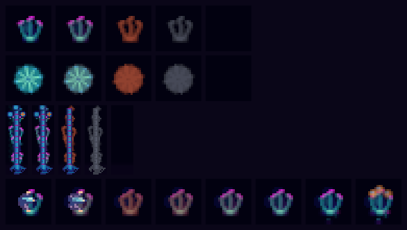

# Workstream B: making ecology v1's plant state readable

Evidence for [the presentation brief](../handoffs/ecology-v1-presentation-opus-2026-09-15.md).
Everything below is a *presentation* decision: no equation, ordering, parameter or
field of the simulation changed, and the only core edit is one read-only
`RenderView` field. Every constant named here is review-tunable from a viewing
session; Wrysk may veto any of them, and §"What to veto first" says which ones
are most likely to want it.

**The physical cube was not inspected.** It belongs to the live runner on port
7393, which this work never touched. Only the web viewer was looked at, on a
scratch state directory and port 7394.

## The contact sheet



`design/7_Research/assets/ecology-v1-presentation-2026-09-15.png` (18 KB,
586 × 332). Every panel is drawn through the real `ArtPresenter` with the
shipped `assets/atelier` pack at the real 64 × 64 face resolution, then cropped
and nearest-neighbour magnified. Nothing in it is an overlay; it is the ordinary
display, cropped.

| row | subject | panels, left to right |
| --- | --- | --- |
| 1 | a side-face **foliage** slot (`CellId(52)`, Front, rank 2) | healthy · half-grazed · stripped-but-living · dead wood · empty |
| 2 | a top-face **canopy** slot (`CellId(1109)`, rank 2) | the same five |
| 3 | a **tall column** (Front, `cx = 7`, glasscane, no vine) | the same five |
| 4 | one **recovery sequence** from a real `World` | ticks 0, 600, 1 500, 3 000, 6 000, 12 000, 24 000, 36 000 |

Rows 1–3 hold the implementation note's measured bright stand (Run 3, B0:
`P = 0.4789`, `W = 0.3934`); "dead wood" moves that `W` into `Wd`.

To reproduce, from the repository root:

```bash
CARGO_TARGET_DIR=/home/wrysk/wryskware/cubarium/target \
  cargo run --release -p cubarium --example ecology_sheet -- \
  --out design/7_Research/assets/ecology-v1-presentation-2026-09-15.png
```

It is deterministic and prints row 4's trajectory to stdout.

### Row 4, the measured trajectory

A bright mature stand on a flat staged habitat (contract §13's own config: no
weather, no rain, no founders, a bare surface, bodies pinned), one pinned grazer
at `diet = 0.85` standing in the stand's cell, removed automatically the first
tick the stand falls below a seventh of its foliage.

| tick | s | `P` | `W` | `Q` | `Wd` |
| --- | --- | --- | --- | --- | --- |
| 0 | 0 | 0.4789 | 0.3934 | 0.1967 | 0 |
| 600 | 30 | 0.1827 | 0.3936 | 0.1767 | 0 |
| 1 500 | 75 | 0.0889 | 0.3936 | 0.1074 | 0 |
| 3 000 | 150 | 0.1394 | 0.3936 | 0.0514 | 0 |
| 6 000 | 300 | 0.2049 | 0.3936 | 0.0084 | 0 |
| 12 000 | 600 | 0.2551 | 0.3936 | 0.0441 | 0 |
| 24 000 | 1 200 | 0.4098 | 0.3936 | 0.0984 | 0 |
| 36 000 | 1 800 | 0.5086 | 0.4308 | 0.1315 | 0 |

The grazer came off at tick 918 (46 s). This is the whole claim in one row:
**`W` never moves** while `P` falls to 19 % and climbs back past where it
started, so the stand's structure is on screen the whole time and only its
foliage travels. The reserve's dip and refill (0.1967 → 0.0084 → 0.1315) is B3's
reflush, visible in the picture as the stand going rust-coloured and then green
again. No dead wood appears: this stand never dies, which is why row 3's dead
panel is synthetic.

## The mapping, and why

All of it lives in `crates/cubarium/src/art_present/habitat.rs`.

### 1. Structure comes from wood

`plant_density` for the **foliage and canopy** bands is now

```text
t = (W / wood_max) ^ WOOD_SHAPE ,   WOOD_SHAPE = 1/3
```

fed through each band's existing `stage_thresholds` and `STAGE_HYST`, unchanged.
`RenderView` gains `wood_max: f64` beside `producer_max`, filled from
`config.plant.wood_max`.

**Why a cube root.** `W` spans `W_min = 0.02` to `W_max = 0.6` — thirtyfold —
while the three stage thresholds span 0.25 to 0.70, under threefold. No linear
normalisation can put a just-alive stand at stage 0 *and* separate an
average-light stand from a bright one; I checked both constraints algebraically
before choosing. A cube root is also the honest physical reading: wood is the
stand's bulk and the sprite is its size.

The resulting foliage-band steps, and where the measured stands land:

| | `W` | `t` | stage |
| --- | --- | --- | --- |
| bare → stage 0 | 0.0094 | 0.25 | — |
| `W_min`, just alive | 0.020 | 0.322 | **0** |
| stage 0 → 1 | 0.055 | 0.45 | — |
| B0 average light | **0.1050** | 0.559 | **1** |
| stage 1 → 2 | 0.206 | 0.70 | — |
| B0 bright | **0.3934** | 0.869 | **2** |
| `W_max` | 0.600 | 1.000 | 2 |

**Visible effect.** The stage-0 entry (`W = 0.0094`) sits *below* the alive
threshold, so **every living cell draws a plant** — the whole of the brief's
claim 1, and the thing §12 said was only readable if the lowest stage is not
empty soil. Two side effects worth naming: establishing cells (`0 < W < W_min`)
above 0.0094 also show a faint sprout, which seems right — there is plant
material there; and a **fresh world is much more vegetated than before**, because
`W_0 = 0.5·W_max·L·μ` seeds almost every cell above stage 0 while producers used
to start at `0.4·P_cap`. The viewer screenshots below show that directly.

### 2. Foliage is a continuous layer on that structure

```text
f = clamp(P / (FOLIAGE_PER_WOOD · W), 0, 1)    FOLIAGE_PER_WOOD = 1.0   (the brief's k)
a = hermite(f / FOLIAGE_FULL)                  FOLIAGE_FULL = 0.85
```

`a` is the share of the stage sprite drawn as foliage; `1 − a` is how far its
colour travels toward the living-wood tone.

**Why `k = 1`.** One metre of foliage per metre of wood is exactly half the
structural cap `P_cap = α·W` (`α = 2`), and both measured ungrazed classes sit
above it — average `P/W = 0.93`, bright `1.22` — so an ungrazed stand of either
class reads as a full canopy, which is what the brief asked for.

**Why the 0.85 shoulder.** It is not slack, it is leaf overlap: the last sixth of
a canopy hides behind the rest of it. It also buys the average-light class a 9 %
margin so ordinary steady-state wobble cannot make the foliage breathe, and it is
what makes a healthy stand draw **exactly** the image this presenter drew before
ecology v1, in one stamp. The cost, stated plainly: a bright stand holds a full
canopy until `P` falls below `0.85·W ≈ 0.334`, i.e. through the first 30 % of its
depletion. Below that the picture follows the stock continuously. If that reads
as hiding depletion on the cube, lower `FOLIAGE_FULL`; at 0.90 the average class
has only a 3 % margin and may flicker.

**Why a Hermite and not a square root.** Zero slope at both ends: neither a full
canopy nor a stripped stand can flicker, which is exactly where flicker would be
most visible. A concave ramp would make a nearly-stripped stand still read a
fifth leafy, which weakens claim 1.

### 3. The travel is one stamp, not a silhouette underneath

This is the one place I departed from the brief's wording, and it is strictly
better on every axis.

The brief describes the foliage sprite drawn at opacity `a` over *the same
sprite's silhouette* in a wood tone. I built that first (commit
785175a), with the silhouette at
`ceiling·(1−a)/(1−ceiling·a)` so the two together always covered exactly the
band's ceiling. Then I replaced it with **one** stamp whose sampled colour travels
`mix = 1 − a` of the way toward the wood tone
(`cubarium_render::Tone`, `stamp_layers_bent_toned`):

- **Correctness.** The coverage is constant in the travel *by construction*
  rather than by an algebraic identity that only held exactly for a fully opaque
  texel. A stand losing its leaves cannot fade out of the ground at any alpha.
- **Exactness.** The drawn pixel is linear in `mix`, so a partly-grazed stand is
  *exactly* the blend of the ungrazed image and the stripped one. That is now a
  unit test in `cubarium-render`.
- **Cost.** It is free. See §"Per-frame cost".
- **`mix = 0` takes the untinted code path**, so every ungrazed stand, every soil
  and water plant, and every other stamp in the presenter is bit-for-bit and
  cost-for-cost what it was.

**The tones.** `LIVING_WOOD_SRGB = 0x9B4633`, a dim warm ember — the one warm
value in a cube whose ground ramps indigo → cyan and whose soil ramps dark plum →
violet-mauve, so a stripped stand reads as a plant standing on the ground rather
than a hole in it. `DEAD_WOOD_SRGB = 0x5A5E6E`, cool ash, deliberately the least
saturated thing on the cube (its linear spread is under a fifth of the living
tone's, which a test asserts).

**The shade.** A silhouette taken from alpha alone is a solid blob: the pack
draws a plant's structure *inside* its outline, not around it, so a stripped
bloomcrown became a filled disc. `wood_shade()` scales the tone by the texel's
own relative luminance — `floor = 0.42`, `reference = 0.30` — which keeps the
drawing. Compare row 2 panel 3 of the sheet: the petals are still there.

### 4. Dead wood

A **second paced `Growth` track per cell**, driven by `dead_wood` through
`wood_fraction` — the same mapping, so a stand that dies keeps the size it had —
with the same `next_stage`, the same hysteresis and the same `advance_growth`
pacing. It is drawn first, under everything living, as a whole silhouette
(`mix = 1`) in the dead tone at `DEAD_WOOD_OPACITY = 0.70` of the band's ceiling.
Its stage steps down as `Wd` decomposes and its stage-0 opacity ramps to nothing,
so it fades to soil and reaches exactly the empty image at `Wd = 0` (tested).

`DEAD_WOOD_OPACITY` is the "dead wood is on its way out" knob: at 1 a field of
standing dead wood reads as busy as a living forest.

No memory of the former species is needed: the cell's species pick is already a
pure function of the cell.

### 5. Bands: which ones are structural

`structural(band)` is **foliage and canopy only**. The soil band's plants are
litter scenery — their stage comes from `D + C`, not from `W` — and painting a
wood silhouette under a mushroom whose size is set by litter would say something
the stocks do not. The water band's reeds stand by depth. **Both keep exactly the
image they had.**

*This is a choice, not the brief's wording, and it is the second most likely veto
item*: it means a stand that dies below the horizon shows no dead wood. The soil
band is the bottom five of sixteen rows of each side face.

### 6. Soil reads litter plus remains

The soil band's plants, the detritus flecks **and** the soil ground wash all read
`detritus + carrion` over `SOIL_SCALE` (`litter_density`), as §12 allows until a
carcass look exists. Remains keep the existing fleck treatment; a carcass now
reads as a denser patch of it rather than as nothing.

### 7. Ground cover kept the producer read

`ground_density` is the old `plant_density`, and the ground-cover texture still
uses it. Ground cover is low cover, not structure: it should thin out under
grazing with the foliage field, not persist with the wood. This is why
`plant_density` and `ground_density` are now two functions.

### 8. Tall columns

- **Height from wood.** `column_density` averages `wood_density` over the
  column's foliage cells instead of the producer density, at **no further
  scale**. A stripped column therefore holds its height.
- **Crown by fullness.** The cap — the column's crown, which is foliage — is
  stamped at `TALL_OPACITY · fade · foliage_ramp(column_fullness)`. A stripped
  column keeps its trunk and loses its head. The trunk is wood and is drawn
  unchanged.
- **A dead column** is its own paced height track on `column_dead_density`, drawn
  first, base and trunk only in the dead tone: no crown, no climber.

**Visible effect, and the thing most likely to want a viewing session.** The
implementation note's bright stand scored 0.53 on the old producer read (four
trunk segments of nine) and its average-light stand 0.11 (no column at all). Read
through `wood_density` the same two stands score 0.87 and 0.56 — **eight segments
and four**. So bright columns roughly double in height and average-light cells
grow columns where they grew none.

I tried a `TALL_WOOD_SCALE = 0.75` to temper that (bright 4 → 5, average 0 → 2)
and **removed it**: at any scale below 1, `tall_rise(9) = 0.93` becomes
unreachable, so the crown would never land on the rim cell and never be carried
onto the top face — a designed behaviour with its own corner-cap machinery and
test suite. The knob for a forest that reads too dense is `TALL_STEP`, which
moves the thresholds rather than the reading. This is recorded in the doc comment
above `tall_rise`.

## Tests

Authored as their own pass, after the implementation, from the contract and the
public doc comments rather than from the code —
`crates/cubarium/tests/art_ecology.rs`, 17 tests. What each claim is tested by:

| the brief's claim | the test |
| --- | --- |
| the mapping is the cube root, and total on nonsense | `the_structural_read_is_the_cube_root_of_the_wood_fraction_and_is_total` |
| the calibration lands where the brief asked | `the_calibration_puts_the_measured_stands_where_the_brief_asks` |
| both ungrazed classes read full; stripped reads none | `both_ungrazed_classes_read_as_a_full_canopy_and_a_stripped_one_reads_as_none` |
| the ramp is monotone, flat at both ends, total | `the_fullness_ramp_is_monotone_flat_at_both_ends_and_total` |
| **five states pairwise distinguishable**, at two cells | `the_five_states_of_a_cell_are_pairwise_distinguishable` |
| **a stripped stand is the healthy one's structure** | `a_stripped_stand_paints_the_same_structure_the_healthy_one_paints_under_its_foliage` |
| **fullness is monotone at fixed `W`** | `foliage_is_monotone_in_the_stock_at_a_fixed_structure` |
| growth does not mask depletion | `growth_does_not_mask_depletion_the_stage_falls_with_the_wood_that_carries_it` |
| **dead wood fades monotonically, soil at zero** | `dead_wood_fades_monotonically_with_its_stock_and_reaches_soil_at_zero` |
| dead is quieter, cooler, less saturated, same shape | `dead_wood_is_quieter_and_a_different_colour_from_the_living_structure_it_replaces` |
| the handover never goes bare | `a_dead_stand_takes_over_from_the_living_one_and_both_show_while_dieback_runs` |
| **no flicker**, strip → reflush | `stripping_and_reflushing_a_stand_adds_no_step_a_standing_one_does_not_have` |
| **no flicker**, die → decompose | `a_dying_and_decomposing_stand_adds_no_step_a_standing_one_does_not_have` |
| **`draw` mutates nothing, re-observe is idempotent** | `drawing_mutates_nothing_and_re_observing_a_tick_is_idempotent` |
| a capped-out slot grows no dead wood either | `a_cell_that_grows_nothing_grows_no_dead_wood_either` |
| soil and water are undisturbed | `the_structural_read_does_not_disturb_the_soil_or_the_water_band` |
| soil reads `D + C`, structural bands read `W` alone | `the_soil_band_reads_litter_plus_remains_and_the_structural_bands_do_not` |

Plus one in `cubarium-render`:
`a_toned_stamp_moves_colour_only_and_is_linear_between_its_ends` — the toned
stamp covers the pixels the untoned one covers, `mix = 0` is the untoned stamp
bit for bit, any `mix` is exactly the blend of the two ends, and a nonsense
`mix` is the untoned stamp rather than a panic.

### Two bounds that had to be stated rather than assumed

**The footprint test is a 95 % bound, not equality.** A stripped stand touches no
pixel the healthy one does not — that is asserted exactly — but it may touch
three or four fewer out of ~110: the wood tone is darker than the brightest leaf,
so at the sprite's faintest edge texels the composite can round back onto the
background in `f32` where a leaf would not have. The test asserts subset plus
≥ 95 % coincidence and says why.

**The flicker bound is an excess over a standing control, not an absolute.** The
absolute frame-to-frame change of any plant is dominated by its authored sway
clip and the wind bend, which move every frame and predate this work. Both
sequences are run at three frames a tick — the real render rate — against a
control that holds the stocks still. Measured:

| sequence | worst frame step | standing control | excess |
| --- | --- | --- | --- |
| strip → reflush, 120 ticks | 0.0651 | 0.0651 | **0.0000** |
| die → decompose, 160 ticks | 0.0436 | 0.0220 | **0.0216** |

The bound is 0.05. A *cut* would be a step of the order of a plant's own
brightness, 0.3 to 0.85 of full scale; 0.0216 is comparable to what the wind
alone already moves a pixel in one frame. Stripping and reflushing add
**nothing** measurable — which is the tone's linearity showing up in a test that
was not written for it. The dieback number is the dead track's stage steps, and
they are paced by exactly the same clips the living ones are.

### Totals

| crate | passed | failed | ignored |
| --- | --- | --- | --- |
| `cubarium` | 586 | 0 | 18 |
| `cubarium-render` | 101 | 0 | 0 |
| `cubarium-core` | 467 | 0 | 2 |

### Changes to existing suites, with the reason for each

1. **Every fixture that builds a `RenderView` by hand** gained `wood_max: 0.6`
   (17 files). Mechanical; the field is new.
2. **Ten suites gained one call to `wood_from_producer`** in their view
   constructor. These fixtures say "how grown is this cell" as a fraction of the
   producer ramp's saturation point, which is what drove the stage before ecology
   v1. `wood_from_producer` translates such a view into the stocks that drive it
   now — `W = wood_max·d³`, exactly inverting the structural read — and leaves
   `producer` alone, so the ground cover is untouched and every cell's canopy is
   full (`P/W = 1.5/d²`, never below 1.5), which is the case those fixtures were
   written for. No expectation in any of them changed.
3. **Two sites moved from `plant_density` to `ground_density`**
   (`art_plants::expected_ground`, `art_water`). They were rebuilding the
   *ground-cover* expectation, which by decision 7 still reads the producer field.
4. **`art_present/tests.rs::one_cell_view`** now writes `wood` (and a reserve at
   half of it) for the requested structural density, and `producer = wood` so the
   cell's canopy is full. Same reason as 2, stated in its doc comment.
5. **`corner_cap_present_tests` and `vine_strips_present_tests`** pass
   `cap_opacity = 1.0, tone = None` to `draw_column`: those suites test the
   living column at a whole crown and no dead wood, which is what they always
   tested.
6. **`animation_load`** drives its stages from `wood` instead of `producer` and
   gained two arms (below).

Nothing was deleted or weakened. `silhouette_opacity` was removed along with the
two-stamp design it belonged to, and its test was replaced by the stronger
linearity test in `cubarium-render`.

## Per-frame cost

`crates/cubarium/tests/animation_load.rs`, release, one thread, the same host,
the same crowded fixture (every cell stepping through stages, rain everywhere,
200 bodies). Budget is 16.67 ms; the assertion is on the worst one-second mean.

| fixture | before (c8a30fa) | after | |
| --- | --- | --- | --- |
| growing / dry / **full canopy** | 10.076 mean, 10.975 worst | **9.231 mean, 10.137 worst** | the same scene, unchanged |
| wilting / wet / **full canopy** | 10.494 mean, 11.157 worst | **10.334 mean, 11.019 worst** | the same scene, unchanged |
| growing / dry / **half-grazed** | — | **9.217 mean, 10.231 worst** | new; ecology v1's realistic worst case |
| growing / dry / **half-grazed over dead wood** | — | **14.018 mean, 16.111 worst** | new; not reachable |

The two "before" rows are the same two fixtures at `c8a30fa` with their stages
driven by `producer`; after the change the same stage pattern is driven by
`wood`, so the scene drawn is the same. The small improvement is within run-to-run
noise on this host.

**The half-grazed row is the headline.** Every one of 1 280 cells simultaneously
at half fullness costs the same as every cell ungrazed — 9.217 against 9.231 —
because the travel toward the wood tone is a per-pixel lerp inside a stamp the
presenter was already making. The two-stamp design this replaced measured
**14.504 mean / 16.607 worst** on the same fixture, within 0.06 ms of the budget;
that number is why it was replaced.

The last row is the only case that costs a second stamp: every cell carrying a
full living stand *and* a full dead one. Material conservation makes it
unreachable — it would need 1 536 m of plant material — and it is still inside the
budget. All four arms assert against it and pass.

## The viewer check

`cubarium run --art assets/atelier --sink web --web-port 7394 --state
/tmp/claude-1000/ecology-viewer/state --fps 60 --fresh`, a fresh schema-16 world,
build `0.1.0+3c06578`, inspected in Chrome for several minutes. The live cube on
port 7393, its state directory and its process were not touched. **The physical
cube was not inspected and could not be.**

- **Readability.** A fresh world is densely and legibly vegetated: magenta and
  cyan plants on every face, radial plants on the top face, tall glasscane
  columns with cyan crowns standing clear of the wall. This is noticeably *more*
  vegetation than the same opening drew before, for the reason given in decision
  1 — `W_0` seeds nearly every cell above the structural stage-0 entry. Given
  `WORKING_POLICY`'s note that Wrysk found the world had "lost variety and
  vegetation", this is probably welcome, but it is a real change to the opening
  and is the first thing to look at on the cube.
- **Seams.** No discontinuity at any face-to-face edge at the corners I orbited
  to, and the soil/foliage horizon reads as one line all the way round rather
  than a staircase. Nothing about this work moves a stamp's footprint, so I did
  not expect one; I looked for it anyway.
- **Frame pacing.** The world stepped at ~21 ticks/s and produced **3.02 rendered
  frames per tick** measured over a 5-second window, and **2.995 per tick**
  cumulatively at tick 7 731 (seq 23 156) — i.e. the presenter held ~60 frames/s
  continuously for the whole run, which is the pacing target. The viewer's own
  HUD read "1 fps" then "2 fps" and `frames_served` barely advanced, because an
  automation-driven Chrome tab is throttled and stops pulling frames; that number
  measures the automation, not the renderer. The authoritative pacing evidence is
  the `render_seq`-per-tick ratio and the `animation_load` table.
- **At tick 7 731 (6.4 simulated minutes)** the picture was still coherent: the
  same stands, the floor flooded to a pale band as the water settled, one body
  visible on Front, tall columns unchanged. No cell had gone rust or ash, so
  **the viewer never showed me a stripped or dead stand.** 24 founders over
  1 280 cells is not enough grazing pressure to strip anything in six minutes,
  and nothing died. Every grazed, stripped, dead and recovering state on the
  contact sheet was drawn through this same presenter, and row 4 is a real
  stepped `World`, but I did not watch depletion happen in the live viewer.

The scratch state directory was deleted when the run finished.

## What to veto first

In the order I would expect an objection:

1. **Tall columns roughly double in height** and appear in average-light cells
   that grew none (decision 8). Reachable knob: `TALL_STEP`.
2. **The soil band shows no dead wood** (decision 5). It would take a second rule
   for a band whose stage is litter-driven.
3. **A bright stand holds a full canopy through the first 30 % of depletion**
   (`FOLIAGE_FULL = 0.85`, decision 2).
4. **The tones** — `0x9B4633` warm ember, `0x5A5E6E` cool ash — and the shade
   floor/reference that keep a silhouette from reading as a blob.
5. **Establishing cells show a faint sprout** (`0.0094 < W < W_min`).

## Not done

- **No world was run long enough to watch a stand die in the viewer.** Dead wood
  is tested and on the sheet, but the only dead wood I have seen on screen is
  synthetic.
- **The dead tall column is untested at the pixel level.** The cell-level dead
  silhouette has five tests; the column path has none of its own beyond the
  existing column suites passing with `tone = None`. It is exercised by the
  contact sheet's row 3 panel 4 and by eye.
- **No fruit accent on a dead or stripped stand was considered** beyond the
  existing field gate, which already suppresses it.
- **`plant_reserve` is not drawn.** The brief did not ask for it and the reserve
  is legible through the reflush it pays for, but it is the one ecology v1 stock
  with no appearance at all.
- **The corner-cap retained-chart stamp has no toned path.** It is unreachable —
  a toned column draws base and trunk only, where `hold_owner` is never set — and
  the code says so, but a future toned cap would need one.
