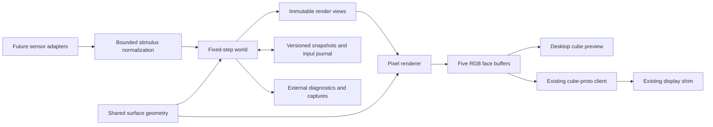

# Runtime architecture

Prefer Rust, a deterministic CPU simulation, and a CPU pixel renderer. This fits
the existing Rust `cube-proto` API and the small output raster. The choice is
provisional; no package manifest or dependency pin is introduced during planning.
The runtime should work headlessly and keep evolving when output is disconnected.

The renderer and observer cannot change the world. Sensors submit environmental
events; they never mutate creature state. Simulation uses no network, wall-clock,
display, or filesystem operations within its step function.

## Code boundaries to create during implementation

| Proposed crate/module | Responsibility |
| --- | --- |
| `cubarium-surface` | Existing Face/seam contract plus continuous travel, unfoldings, neighborhood graph, sampling |
| `cubarium-core` | World state, physiology, controller, field reactions, interactions, reproduction, deterministic events |
| `cubarium-render` | Shared phenotype interpretation, surface rasterization, composition, render interpolation |
| `cubarium` host | Clock, configuration, stimulus adapters, checkpoint worker, frame mailbox, shim output, observer |
| Preview/verification tools | Display the identical frames on a cube/net; replay, capture, accelerated headless runs |

These are ownership boundaries, not instructions to scaffold empty crates now.
Start with the surface crate and a thin host. Keep persistent schema types
separate from serialization format and transient spatial caches. Core may depend
on surface types and lightweight `cube-proto` geometry, never KMS or shim layout.

## Time and transaction order

Start with one fixed **20 Hz** simulation rate for sensing, behavioral drives,
motion, interactions, and field reactions. Rendering/output runs independently
at **30 Hz**. Diffusion may use stability-required substeps inside a tick.
Introduce slower schedules or stable-ID staggering only when profiling shows
the need and replay/ordering tests cover the change. All rates and numerical
substeps belong to the versioned configuration.

One tick:

1. Admit due normalized events in stable `(target_tick, source_id, sequence)` order.
2. Advance bounded weather/stimulus envelopes; perform
   diffusion and producer/decomposer reactions from double-buffered fields.
3. Sample observations and update behavioral drives/memory from a consistent world
   view; calculate bounded action requests and reserve action energy.
4. Integrate swept movement and retain this tick's seam-crossing paths; update
   embedded positions for chord-based pair rejection.
5. Collect contact/feeding/attack requests from post-move positions. Settle shared
   resources and damage once, independent of container iteration order.
6. Apply maintenance, growth, gestation, death, dormant decay, and recruitment.
   Queue structural additions/removals for a stable commit boundary.
7. Check cheap invariants; publish a read-only render view and any bounded
   diagnostic events. A checkpoint captures only a completed tick.

Do not mutate an iterated entity list or let a just-born creature act earlier
because it occupies a low slot. Use stable IDs plus generation-checked reusable
slots; removal cannot redirect a stale target reference to a new organism.

Partition random streams by world process and organism identity, or use
counter-based keyed draws. Extra rendering and logging must not consume evolution
randomness. Stable iteration, reaction order, bounded math, stream state, and
explicit versions define replay. Initially promise exact replay only with the
same build, configuration, and supported host architecture; cross-platform
floating-point bit identity is not assumed.

## Bounded work and overload

Initial capacity proposals:

| Resource | Starting bound/policy |
| --- | --- |
| Active organisms | 512 maximum; seed about 72; evaluate 100–200 as a tuning range, never a live quota |
| Dormant propagules | When enabled: 512; paid deposits, decay, no silent duplication |
| Historical genomes | Observer-only archive of 128; never used for recruitment |
| Field cells | 1,280 with a fixed number of channels and reciprocal edges |
| Local query radius | Sensing at most 12 pixels; chord-filtered all-pairs with exact local surface checks |
| Trail history | Renderer-only, at most 24 segments per creature; timed decay |
| Decorative particles | At most 1,024; replace oldest presentation-only effects |
| Pending stimuli | 256, with source quotas and explicit merge/rejection |
| Output/observer queues | Latest-frame mailbox; bounded event batches |

Entity caps are safety limits, not ecological population targets. A full world
rejects conception before reserving offspring resources; do not randomly kill
organisms to make room. Track cap occupancy and rejection counts. Persistent
pressure against the cap means resource budgets or reproduction need tuning.
At the cap, each pair pass considers at most 130,816 unordered pairs. Stream
pair checks and bound action storage by the declared maximum requests per pair;
one pair may generate requests in both directions. Process all hard contacts. Sensing
may use deterministic nearest-K selection if declared in the phenotype; resource
or contact requests may not be silently truncated. Profile exact-unfolding cost
after chord rejection before introducing spatial bins.

Avoid per-pixel heap allocations and per-tick entity allocation churn. Reuse
buffers, store fields contiguously, precompute topology, and compute controller
phenotypes once at birth. Start single-threaded in core for reproducibility.
Keep output, preview, and storage off the simulation's critical path.

If the host stalls, execute at most four catch-up ticks before dropping render
work and reporting lag. Persistent overload slows simulation relative to wall
time rather than increasing dt, skipping ecological steps, or building an
unbounded backlog. Suspend/resume pauses world time; do not fast-forward a day
of mortality after a laptop sleep. Long-running clock state uses integer ticks.

Provisional target on the actual installation host: world-step p99 below 20 ms,
render p99 below 12 ms, 30 fps output, and total resident memory below 256 MiB
at the active cap. These are acceptance targets, not measured performance claims.
Profile first and change rates or representations with evidence.

## Persistence is part of the world

Checkpoint every 60 simulated seconds and on clean shutdown. Capture schema and
build identifiers, configuration, world tick, all random stream states, all
fields and weather phases, organisms/genomes/behavioral memory, gestation
escrows, enabled propagules, pending normalized events, source sequence and
budget state, extinction-reseed trigger/cooldown, and bounded ecological histories.
Rebuild spatial caches on load. The genome archive is observer-side metadata
and not required for exact ecological replay.

Trail history is renderer-only, derived from a short history of tick-stamped
positions and actual seam-crossing segments in render views. A dropped view
breaks the trail rather than inventing a path across an unknown gap. Restart
fades trails back in; no trail or visual reconstruction consumes simulation
randomness or affects physiology. Later sensed chemical trails are real fields
and, unlike these visual histories, must be checkpointed when enabled.

Write a bounded immutable snapshot through a worker: temporary file on the same
filesystem, checksum and length, flush, atomic rename, then flush the containing
directory where supported. Retain several previous valid checkpoints (initially
eight) before pruning; never delete the last known good snapshot first. Validate
schema, numeric ranges, capacities, and checksum before admitting a load.

Journal accepted normalized stimuli and configuration changes with tick/sequence
metadata, rotating by size. Exact replay uses a matching snapshot, build, and
journal range. Ordinary restart resumes the latest valid completed checkpoint;
it can lose up to the checkpoint interval, and does not pretend to have replayed
an unjournaled external input. Pair journal retention with snapshot retention.

Disk retention has a byte budget as well as a file count: initially 256 MiB for
telemetry/journal and a separately measured budget for eight snapshots. Captures
are opt-in and quota-limited. Slow/disk-full storage retains the previous valid
world and reports failure without accumulating snapshots in RAM. Read errors
try older snapshots. If all are invalid, preserve them and start a clearly logged
new world only under the configured unattended recovery policy.

## Display integration and operations

Use the shim's `Frame`, `CubeClient`, and geometry; never reimplement its UDP
format, panel rotations, gamma correction, brightness limiting, DRM, calibration,
or idle behavior. Follow current API source when implementing. The existing
client sends through a worker with a newest-frame mailbox because its API is
blocking. On errors, retry with bounded backoff while simulation continues.

The preview consumes the same five face buffers and shows a rotatable physical
cube and optional unfolded net. Controls, labels, and field/lineage views are
explicit developer modes, disabled in ambient output. Make headless speed-up,
fixed-seed replay, selected frame capture, and log export available outside the
normal presentation.

Later installation work adds a restartable user service, configurable state
directory, graceful shutdown, and local health output. It does not require the
shim to restart with Cubarium. No service or live display is changed in this
planning phase.
