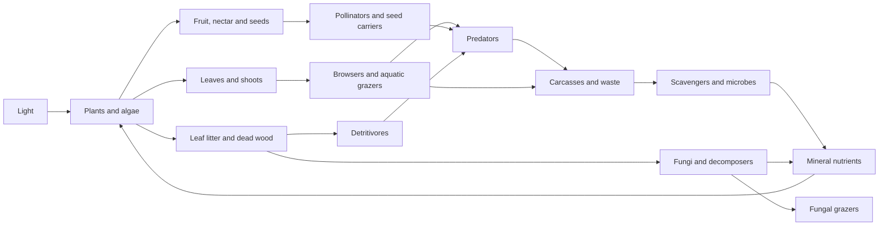

# Landscapes that grow ecosystems

Planning proposal following Wrysk's 2026-09-16 request. Nothing here promotes a
decision, starts implementation or training, or changes a running world. The
first proposed investigation is voxel terrain, water and presentation in a
ringworld running locally on a desktop, with device adaptation later. The larger
ecosystem and product ideas describe what that foundation should make possible.

## 1. Direction and what we learned from earlier work

Make Cubarium a small place with recognizable geography and ecological history:
a wooded ridge, a spring, a wet hollow with glowcaps, a flower clearing, a rocky
refuge. Changes should have causes that a person can learn by watching.

Wrysk asks for varied terrain, plants that reproduce locally and have different
environmental requirements, differentiated animal diets, richer ecological webs,
water beyond rain, more species and recognizable lineages, and a compelling desk
pet/game. Wrysk subsequently clarified the cube picture: **five shallow 3D
habitats joined at their side and top edges, with depth inside each habitat**.
Wrysk then clarified **voxel terrain**, a central mountain/bedrock mass for the
cube, side views into habitats with solid floors, and gravity toward the desk.
Finally, Wrysk prioritized the **2D panel ringworld first**, using the same voxel
physics and landscape principles. These directions replace the earlier
heightfield-first and unresolved-gravity recommendations in this document.
Storage, fluid solver, projection and exact boundaries remain proposals; no
accepted ledger entry is added.

Wrysk also raised a later player terrain builder, potentially separate from the
runner, and artificial devices such as a groundwater pump feeding a hilltop
spring. This is a future product/design direction, not permission to begin an
editor or device implementation during this planning pass.

Wrysk's final platform clarification: **this cycle is local desktop development**,
with a local renderer, potentially reusing the Tachyon renderer on desktop
hardware. Ringworld-first describes the simulated layout, not a deployment to
the physical panel. Cube/panel rollout and hardware optimization are later work.
This is a planning-only update; no prototype is implemented in this pass.

Wrysk subsequently expanded the product direction into an actual game: a
potentially barren opening, starting budget, reproduction-earned genome points,
biological upgrades and a science tree of terraforming devices, with accelerated
or real-time play and optional local day/night synchronization. The separate
[game roadmap](game-roadmap-2026-09-16.md) develops that pitch and its open
questions. It does not reorder the local voxel ringworld/terrain/water work.

The [landscape review](landscape-plan-2026-09-16.md) makes an important visual
finding: the synthetic landscape's apparent hills were vegetation silhouettes;
larger patches and negative space distinguished it from the live ring more than
instance count. Keep that compositional lesson. Its incremental `ground(u)`
proposal and promise to leave the cube unchanged do not constrain this redesign.
Its measurements describe its cited worktree and captures, not a new measurement
of today's display. This proposal has not regenerated those captures.

The [flat-world proposal §8](flat-world-plan-2026-09-16.md#8-biome-and-terrain-variation-separable)
suggested biome offsets to existing fields. That can recolor and redistribute a
world, but it does not supply separate plant species, establishment, branching
drainage or groundwater. The new model should give those differences causes.

Earlier ecology work already supplies valuable foundations:

- [Food-web reconsideration](ecological-niches-reconsideration-2026-09-15.md)
  and its [review synthesis](7_Research/food-web-review-synthesis-2026-09-15.md):
  food identity, persistent plant structure, paid growth, finite energy, and
  specialization with a cost.
- [Ecology v1](ecology-v1-contract.md): structured stands and paid neighbouring
  propagules already have a contract. Species-specific plants and dispersal
  would extend/replace that abstraction, not introduce the first recolonisation.
- [Measured plant budgets](7_Research/ecology-v1-plant-budget-2026-09-16.md#6-the-verdict):
  in the reported configurations, 73 crossing cells declined with no exact
  foliage withdrawal. Unsuitable openings can brown without grazing. This does
  not explain every vegetation loss or prove equilibrium.
- [Round-5 synthesis](7_Research/ecology-v1-round5-results-2026-09-16.md#what-this-does-and-does-not-establish):
  depth-only skimmer tuning did not meet its criteria; successful lineages could
  shift toward the grazer's food channel. A different habitat preference alone
  does not create a distinct food web.
- [Recurrent organisms](recurrent-organism-plan.md) and
  [whole-ecosystem search](ecology-search-plan.md): reuse the actual simulator,
  separate body feasibility from policy choice, evaluate reproduction beyond
  founders, preserve multiple candidates, and bound compute before searching.

## 2. Voxel world, ringworld first

**Current owner direction:** first develop and test the ringworld locally on
desktop, then adapt the same voxel physics and landscape design to the cube and
physical panel. “2D” is taken
here to describe the panel view, not a requirement to flatten the simulation:
the candidate is a shallow 3D habitat displayed in two dimensions.

### First domain: a horizontally periodic voxel strip

Use `(x,y,z)` in common world coordinates: x along the panel, y vertical, z into
the habitat. Gravity is `(0,-g,0)` everywhere. The domain is:

```
x in [0,L), with x=0 adjoining x=L
z in [0,D], finite habitat depth
y in [0,H], vertical space above a solid lower foundation
```

Left/right neighbours wrap; front/back depth boundaries and the base do not.
Sky does not wrap into ground. Air can be empty voxel space without simulating
a second fluid. Animals retain continuous positions even if terrain is discrete.

The horizontal ground domain is a periodic strip, topologically a cylinder;
the full habitat is `S¹ × [0,D] × [0,H]`. No embedded donut geometry or curved
gravity is required. A second horizontal wrap could make the ground toroidal,
but it is not needed for the first ringworld. Use the simpler cylinder for the
first proposed test domain; this is an implementation recommendation, not a new
owner decision about topology.

Terrain is genuine 3D material occupancy. A height function may help create an
initial landform, but it is not the authoritative terrain representation. Voxel
solids permit ledges, overhangs, multiple ground surfaces at the same horizontal
location, and later burrows. Render visible surfaces; buried voxels still exist
and affect roots, permeability, collisions and eventual digging.

The panel's pixel dimensions do not prescribe voxel resolution. World width,
height, depth and cell size are separate simulation choices, to be selected from
native-size legibility and measured cost. Start with a small test domain and a
bounded depth, not one fluid simulation cell per display pixel by assumption.

### Ringworld presentation

Compare a side-on orthographic view with a slightly elevated orthographic view.
The first gives clear silhouettes and an aquarium feeling; the second exposes
more ground and water surface. Both show the same 3D world. Terrain and plants
occlude what is behind them; underground material is hidden by ordinary opaque
surfaces, not deleted or made ecologically inactive.

Keep a modest depth range so creatures do not spend most of their time hidden
behind scenery. Arrange foreground openings, terraces and background rock as
part of generation, while leaving positions and interactions physically real.
A small cutaway can be an explicit development view, not the default display.

At the wrap, duplicate only the necessary rendered images of seam-crossing
objects. They share one organism/voxel/water identity. For a camera with a depth
component, verify projected seam images at every depth rather than assuming a
2D sprite wrap remains sufficient. Changing the camera never changes physics.

### Later cube: one landscape around a central bedrock mass

Wrysk's picture is five shallow connected habitats, with the inner void acting
as a mountain/bedrock core. The proposed realization is **one shared 3D voxel
world viewed through five windows**. Five regions can still organize generation
or storage, but their overlaps and corners refer to the same world cells.
Do not attach five overlapping boxes with independently owned water.

Keep the same vertical gravity as the ringworld. Shape the bedrock to provide
upper hollows, sloping flanks, ledges and shelves, and varied lower ground around
its foot. The top view shows upper ponds and vegetation; side views look into
small aquarium-like habitats, including their solid floors. Streams cross from
the upper catchment to the flanks through real slopes, not rotated gravity or
position teleports. An unbroken vertical wall would shed water and offer little
rooting space: habitable slopes and terraces must be generated deliberately.

The deep core may use compact uniform chunks and aggregate groundwater storage;
being hidden does not require simulating every interior rock voxel every tick.
The active terrain and water still have one authoritative coordinate system.

Five fixed cameras do not automatically make arbitrary interior geometry look
continuous across physical face edges for every viewer. Use the shim's face
orientation/hardware contract, but do not assume its outward-looking cubemap
helper is an outside-looking-in terrarium camera. A later cube storyboard must
show the same tree/stream/creature approaching a side corner and a top corner,
checking duplication, disappearance and occlusion at normal viewing positions.
No viewer tracking is assumed. This presentation problem is deferred behind the
ringworld study, not a blocker for the shared physics.

### What is shared, and what differs

| Shared between ringworld and cube | Specific to each domain |
| --- | --- |
| Voxel materials, solidity, soil properties and water-volume accounting | Periodic strip versus bedrock core with surrounding habitat |
| Gravity, infiltration, groundwater, plant access and body collision rules | Boundary neighbours, outlets and weather exposure |
| Species physiology, local dispersal and ecosystem evaluation | Landform recipe, habitat depth, cameras and screen mapping |

A display face is not a physics boundary. The ringworld's wrap is a physics
connection; the cube's camera boundaries are views into one world. Encapsulate
neighbour/boundary rules so shared physics does not accumulate special face
rules. Equal rules do not require equal worlds or equal pixel/voxel scales.

Do not overload one `height` value: distinguish global y, height above a local
supporting surface, water depth/head, canopy height and screen row. Multiple
voxel surfaces mean there need not be one ground height for an entire column.

## 3. Generate geography before vegetation

Prefer a feature-guided generator whose output is verified by hydrology. Pure
noise is a useful baseline and source of detail, but is a weak primary author
of readable valleys and connected streams. Research on hydrology-guided terrain
provides a precedent, not a requirement to reproduce a large terrain engine;
see the [research note](7_Research/terrain-ecology-foundations-2026-09-16.md).

Proposed creation sequence:

1. Start with the shallow periodic ringworld: choose physical units, voxel
   size, extent and boundary conditions. Use the same domain and input budgets
   when comparing generators, not merely equal display pixels.
2. Place a small number of broad features: ridges, hollows, flats and exposed
   rock. Start with three recognizable regions in the ringworld as a visual
   hypothesis: an upland, a moist slope and a receiving hollow. Native-size
   readability determines how many the panel and later cube can support.
3. Choose terminal basins/outlets and candidate recharge areas. Construct a
   drainage skeleton from higher tributaries toward lower terminals; fit broad
   hills and valleys around it. The periodic strip can contain interior terminal
   ponds or named boundary outlets; a wrap is not an outlet.
4. Add secondary ridges, terraces and outcrops, plus weaker correlated detail.
   Keep channel floors and spill heights coherent. Evaluate periodic landforms
   consistently through x=0/L, including slopes and material layers. Then form
   voxel rock/soil volumes and a few test ledges or overhangs. Every carve must
   be rechecked for unintended leaks and inaccessible isolated voids.
5. Derive soil depth, permeability and water capacity from geology, slope and
   deposition hypotheses. Avoid making elevation, fertility and moisture the
   same noise field: sunny low ground and infertile wet ground should be possible.
6. Run a bounded **proposed future** water warm-up under specified rainfall and
   recharge. Measure flow, wet duration and dry refuges. Do not label every
   visually carved channel a perennial stream.
7. Establish plants from viable local founders/propagules. Condition the opening
   community under its actual environment, recording the time and resource input.
   Do not seed every cell at a biomass it cannot support, then call the retreat
   an animal behavior problem.

Use the same seed through separate deterministic streams for landforms, soils,
climate and founders. This lets a comparison change geology without silently
changing every animal. Retain seed/config, compact metrics and chosen outputs
in normal source history, not piles of builds or captures.

“Biome” should usually be a useful name for a persistent combination of soil,
wetness, light, disturbance and inhabitants. A forest can make its own shaded
understory; it is not a permanent paint mask. Authored starting regions are
compatible with later succession. At this scale, habitat mosaics are often a
better target than miniature continents with every climate zone.

## 4. First water and physical model

### State and units

Use physical length, time and volume units independent of pixel coordinates.
A voxel of side length a has geometric volume `a³`; a material's pore capacity
is a fraction of that volume. Water is fractional volume, not an on/off blue
block. Voxel terrain does not require visibly block-shaped water or creatures.

| State | Role |
| --- | --- |
| Solid/material occupancy: bedrock, rock, soil, organic substrate | Collision, visible surfaces, support and available pore/void volume |
| Free-water volume in connected void cells, with flow information | Ponds, streams, falling water and pools beneath ledges |
| Water held in soil pores, bounded by local capacity | Root-accessible moisture; distinct from free water |
| Aquifer storage, hydraulic head, connectivity and outlets | Slow groundwater supply and seepage |
| Rain, evaporation, transpiration, recharge and boundary flow counters | Explain every change in total water |
| Optional atmospheric reservoir | Stores evaporated water if explicit recycling is selected |

A volume may be free water, local pore water or aggregate aquifer water; do not
count it in two representations. Spatial aquifer boundaries and transfer sites
must be defined if the core is represented by aggregate reservoirs. Solid soil
can hold pore water without letting bodies walk through it.

### Free water: a solver question to test, not yet a chosen algorithm

The earlier heightfield edge formula in this proposal is no longer a complete
solver candidate. With voxels, water can occupy several disconnected vertical
intervals in one column and travel below an overhang. Collapsing these to a
single bed height would discard the requested geometry.

For the first ringworld study, compare a small conservative voxel-volume model
against the behaviors below. It should support downward falling transfers,
lateral spreading, a still free surface, obstacle blocking and overflow. Every
transfer is debited and credited once, limited by the donor's available water
and the receiver's available void space, with a common proposal/settlement state.
Use deterministic substeps and a timestep restriction; traversal order must not
create the preferred stream direction. Displaced water cannot disappear when
terrain is edited: either move it to available space, retain it in the solver,
or reject the edit if its semantics cannot yet be satisfied.

A naive “fall, then even out neighbouring fill fractions” rule is not enough
for all voxel plumbing. Connected vessels may need pressure to lift water on
the other side of an obstruction. Specify pressure/head behavior and test a
U-shaped passage, including different fill levels and a blocked connection.
Do not call a rule physically correct merely because its total volume balances.

If the small model cannot support these cases without ad hoc exceptions,
evaluate a coarse free-surface grid solver with pressure projection. That is a
separate measured complexity/cost choice, not implied by choosing voxels.
The [GPU Gems fluid chapter](https://developer.nvidia.com/gpugems/gpugems3/part-v-physics-simulation/chapter-30-real-time-simulation-and-rendering-3d-fluids)
provides a reference for grid velocity, pressure, obstacles and liquid surfaces;
its numerical implementation is not automatically conservative enough for our
long-running ecosystem. Verify volume drift and actual hardware cost ourselves.

Keep the first scope legible: slow streams, ponds, spillways and short falls.
Fine turbulence, spray, foam and trapped-air dynamics are later questions.
Decorative splash particles, if used, must not become a second water store or
replace the transfer being depicted. Derived surface meshes/rendering do not
own a separate fluid state. All habitats use global vertical gravity.

### Soil, groundwater and where the water goes

Rain enters exposed top surfaces of the world; do not rain independently into
every buried or covered voxel. Canopies can intercept it later with accounted
storage/drip transfers. Infiltration moves free water into soil pores, limited
by permeability and remaining capacity. Drainage transfers soil water to the
connected aquifer. Saturation can cause seepage back into free space. Every
reservoir has an explicit capacity/overflow rule; no clamp deletes excess water.

A spring needs hydraulic head above its outlet, with surface-water backpressure
when submerged. Groundwater head comes from storage and geometry, not a fixed
output attached to a decorative spring. Water collected below cannot passively
refill a higher pond: that requires sufficient recharge head, an external source,
or a powered lift. Groundwater and surface water can exchange in either direction
according to head; see [USGS](https://pubs.usgs.gov/circ/circ1139/htdocs/natural_processes_of_ground.htm).

The user suggested outflow, groundwater and evaporative recycling as options,
not a final boundary contract. They can coexist with separate accounting:

| Fate | Meaning | Proposed first-study treatment |
| --- | --- | --- |
| Infiltration/recharge | Water remains inside the world in soil/aquifer storage | Include; measure delayed release from one lower spring |
| Evaporation/transpiration | Water leaves free/pore storage | Include as named loss under prescribed weather |
| Atmospheric recycling | Evaporated water enters a finite reservoir, later becoming rain | Add as a separate bounded comparison; reserve water before distributing a rain event |
| Surface boundary outflow | Stream crosses a named physical opening | Test one explicit weir/outlet; the wrap never silently drains water |
| Hidden catch reservoir | Outflow is retained offscreen rather than lost | Optional; name the store and any route back rather than immediately respawning water uphill |

Start with prescribed rain, explicit evaporation loss and a finite aquifer to
isolate the physics. Then compare an atmosphere-reservoir mode using exactly
the same terrain. This stages the study; it does not reject the user's recycling
idea or choose the final product's climate model.

With explicit atmospheric recycling and no retained plant water:

```
W = free water + soil pore water + aquifer water + atmospheric water
    + any explicitly modelled catch-reservoir water

delta W = external rain/recharge + user water - true boundary export
```

Evaporation, transpiration, internal rain, springs and infiltration are then
internal transfers. In the simpler prescribed-weather mode, omit the atmosphere
store and count rain in, evaporation/transpiration out. Do not mix the two
ledgers. Weather may schedule where rain falls, but cannot withdraw more water
than its source holds. A recycled water cycle is driven by atmospheric/thermal
energy, ultimately an external energy input; closed water does not mean a closed
energy system. Thermodynamics need not be simulated in the first approximation.

For an aquarium-like side view, the solid floor is the terrain/foundation and
the viewing plane can initially be a no-flow boundary. A stream leaving the
world needs a real opening and specified discharge, not merely a camera clipping
plane. On the future cube, an outlet can visibly spill through a selected low
side opening. Groundwater, atmospheric recycling and export should remain
separately measurable. Water must not create nutrient or edible energy; later
solute transport needs concentration and matching source debits.

### Two hand-worked model checks (not simulator results)

**Spill threshold.** Take three equal-area interior cells with bed elevations
`[0, 1, 0]`, outer walls higher than 2, and no infiltration/evaporation. Put water
only into the left hollow. With volume 0.6 it stays there. Under slow,
non-inertial equilibration, volume 1.4 fills the left hollow to the crest (1.0)
and spills 0.4 into the right. The ridge is dry again; the two pools do **not**
equalise to 0.7 through it. With volume 3.2, all three cells connect at surface
level 1.4: depths `[1.4, 0.4, 1.4]` sum to 3.2. These are candidate fixtures
that distinguish actual terrain from decorative height noise.

**Spring memory.** In arbitrary volume/hour units, take `G(0)=10`, discharge
threshold `Gcrit=2`, and `Q=0.1*max(G-2,0)`, without recharge or other losses.
Then `G(t)=2+8*exp(-0.1*t)`. At t=10, groundwater is approximately 4.943 and
cumulative spring discharge is 5.057. Their sum remains 10; spring flow falls
from 0.8 to approximately 0.294. A spring outlasting rain emerges from storage,
but finite storage cannot support an unchanging stream indefinitely. These
numbers demonstrate bookkeeping, not a proposed game timescale.

### Other physics to include or defer

Include slope-dependent ground travel, impassable rock, water-depth-dependent
access, plant rooting space, canopy shade and real cover/line-of-sight effects.
Use continuous body locations, voxel collision/support queries and explicit
access costs. Terrain height, line of sight and reachable food must come from
actual 3D geometry. Ground animals cannot graze inaccessible crowns through a
shared screen pixel.

Defer general rigid-body dynamics, continuous terrain erosion, turbulent fluids,
procedural cave networks and detailed soil chemistry. Include one overhang and
one covered water passage as voxel-geometry checks even in the first study.
Add sediment or burrowing
when an ecological role or player action needs the terrain to change. These are
scope choices for the first study, not permanent prohibitions.

## 5. Build habitat communities, then connect them

Use a modest roster of functional species, with several visible species sharing
mechanisms. Start by describing complete communities, then implement/test small
connected subsets. A proposed eventual palette is 8–12 sessile species and 6–8
animal species; the first coupled experiment needs fewer. Counts are creative
scope estimates, not target populations or promises to keep every species alive.

| Habitat | Sessile inhabitants | Consumers and relationships | Observable story |
| --- | --- | --- | --- |
| Sunny meadow | Two flowering plants with different bloom/drought responses, low grazeable cover | Leaf browser; nectar feeder that can carry pollen; seed eater/disperser | Blooms spread from surviving patches; browsing opens gaps |
| Moist grove | Canopy tree, fruiting shrub, shade groundcover | Fruit glider; litter shredder; small stalking predator | Trees shade out flowers; fruit carries descendants into clearings |
| Shaded deadwood hollow | Glowcap fungus, moss-like producer | Fungal grazer; wood/litter processor | A fallen trunk supports a glowing patch, then becomes soil |
| Spring and stream | Reed, aquatic mat/alga | Aquatic grazer; detritus feeder; shoreline hunter | Dry weather contracts habitat toward the spring |
| Rocky dry ridge | Slow crust/lichen analogue, drought shrub | Small seed forager using crevices; occasional predator | Refuge persists while wetland species retreat |

Glowcaps need an explicit metabolic identity. If fungi, they consume organic
matter and respire; their glow is an energy expense, not an excuse for free
photosynthesis in darkness. The existing plant-like art name does not settle
the new biology. Aquatic production likewise needs light and nutrients rather
than a magical energy floor simply because the cell is wet.

Plants need identity in the simulation: species, local biomass/structure,
reserve, age/life stage and propagules. Small plants can be cohorts; trees can
be sparse individual entities. The renderer must derive species, occupancy and
stage from these, rather than decorating one generic producer pool with species.

Establishment requires a **paid local propagule**, suitable soil water/light,
space and time. Mostly short dispersal produces patches; rare longer wind,
water or animal transport allows recolonisation. Survival, growth and seedling
establishment can have different tolerance curves. Some plants sprout after a
wet pulse; others survive a dry period but fail to germinate in it.

Give each plant a few meaningful trait axes: shade response, drought/flood
tolerance, rooting/access depth, growth versus persistence, reproductive
investment and dispersal. Shared light, water and nutrient budgets prevent each
new species from creating an additional copy of the world's productivity.
Wide tolerance or broad digestion should cost a measured capability tradeoff;
do not multiply arbitrary penalties until specialists win by decree.

Animal diet has three parts: physical access, digestive yield, and behavioral
preference. A leaf browser might favour one plant's tender shoots but tolerate
another's tougher leaves. A fruit specialist should not survive equally well
on all generic green biomass. A shared mouth/gut budget limits broad diets.

The web has several channels, not a taller single chain:



Arrows are potential transfers, not fixed conversion efficiencies. All living
groups pay upkeep and ultimately contribute remains; the diagram omits those
repeated arrows. Pollination, seed transport, shade, cover and soil modification
form another network alongside feeding. Baseline decomposition and some
reproductive redundancy avoid a single lost species switching off the world.
Their rates should still matter enough for removal experiments to detect them.

Initially evolve traits and behavior **within** a designed functional palette.
Local selection may then shift niches. Unrestricted invention of new digestive
chemistry or trophic roles is a different research problem. Colour accents can
mark inherited lineage identity without claiming a new ecological species. Keep
species silhouette/locomotion readable and bound hue variation so the scene does
not return to confetti. Track ancestry separately from colour collisions.

## 6. Search whole ecosystems without hiding failure

Design an ecosystem candidate as terrain recipe + water/climate regime + species
traits + initial resource budgets + founder mix + a set of policies. First fix
terrain/water correctness, then measure what that environment can support. A
brain cannot learn an energetically impossible niche.

Use three distinct loops:

1. **Mechanism probes:** actual growth, intake, access, turnover and costs in
   small habitats. Simple diagnostic controllers can establish feasibility;
   they are labelled controls, not evidence of learned intelligence.
2. **Offline ecosystem selection:** evaluate complete interacting communities,
   alternating bounded policy training with ecology/trait/terrain tuning. Keep
   a small diverse pool of opponent/community contexts. Freeze versions within
   comparisons so a policy improvement cannot secretly mean an easier world.
3. **Live inheritance:** paid births, bounded mutations, environmental selection
   and optional dormancy. The device need not run the expensive outer optimizer.

The existing recurrent/ES work can supply a training backend. New terrain needs
new observations for accessible substrate, slope, depth, cover and food identity;
old height semantics and saved policy success must not be silently reused.

Prefer a small quality-diversity collection of viable **worlds** over one score
winner: a meadow-rich world, a wooded world and a spring-fed world can all be
good products. Measure distinct outcomes rather than rewarding raw population:

- Living vegetation, recruitment, resource renewal and animals completing the
  reproduce–mature–reproduce chain beyond founder subsidies.
- Realized diets and habitat use; regional composition differences as well as
  total species counts. Hue/genome spread is not ecological diversity.
- Recovery after finite dry spells and local disturbances, with untouched seed,
  climate and terrain families used only for evaluation.
- Spatially distinct patches and useful quiet periods; no reward for perpetual
  motion, maximum brightness or reaching a population cap.
- Sensitivity to removing a resource or interaction, with material/energy
  accounting that separates diet dependence from a generic starvation shock.

MAP-Elites is a candidate organizational method, not proof of stable coexistence.
Start with coarse descriptors and a bounded candidate set before expanding the
search dimension. Benchmark throughput on each target model, then name candidate
count, seeds, horizon, concurrency, storage and wall-time limit. Do not launch a
campaign from this document. Longer tests must exceed initial stored-food and
groundwater transients and several relevant generations; short success is a
screen, not indefinite sustainability.

## 7. The desk-pet/game opportunity

The later [game roadmap](game-roadmap-2026-09-16.md) extends this ambient-care
exploration into a progression game. Its barren-start/campaign idea and the
pre-established landscape presets below can serve different modes; neither
starting-world policy is mandatory for the physics prototype.

The central promise could be **“a little place that becomes yours.”** Geography
provides landmarks, organisms provide attachment, and inherited differences
provide continuity. A memorable old tree and the blue-accented descendants that
visit it are more legible than a diversity counter.

Proposed interaction loop: notice a change → make a small intervention → see its
immediate physical effect → return later for ecological consequences. Examples:

- Plant a limited packet of meadow seeds in a clearing; see which establish.
- Place a porous stone or log that creates shade, cover or a shallow catchment;
  water and organisms actually respond to its geometry.
- Give a small rain pulse to a drying hollow, then watch local spread and animal
  visits. The effect should be traceable without guaranteeing a scripted bloom.
- Follow/name a lineage; collect observations such as a first flowering,
  successful pollination or first second-generation offspring in a new habitat.
- Choose a starting landscape temperament: spring garden, dry rock garden or
  woodland pool. This chooses a viable candidate, not an ecological difficulty tax.

The default should survive ordinary absence without guilt, daily chores or
punitive neglect. Attention changes the direction and story; it should not be
the hidden source of all viable life. Optional challenge scenarios can ask for a
particular habitat outcome. A field journal, care controls and detailed history
belong on demand; the normal display remains the world.

Calm night brightness, one-handed physical interaction, offline persistence,
recognizable sounds only if desired, and graceful recovery from power loss are
product hypotheses to revisit after the landscape reads. A bounded daily event
summary could help people notice what changed without a capture archive. User
ownership, willingness to return and willingness to pay remain untested; technical
ecological stability is not evidence of product demand.

### Player-authored worlds and useful artificial objects

Wrysk's terrain-builder idea makes the voxel landscape a potential game in its
own right: sculpt a place, arrange its water supply, plant it, and discover what
community it supports. Natural and constructed objects can coexist. A visible
pump supplying a high garden is more understandable than a hidden water source.

Separate the **authoring application** from the **runner**, while sharing the
world format and the libraries that define materials, devices and physics.
The editor may have sculpting tools, procedural brushes, undo, and accelerated
preview; the small device only needs to load and simulate the result. A separate
UI or renderer is reasonable. A second, approximate water engine that disagrees
with the runner would make design frustrating; preview should run the same
simulation rules where it claims to predict behavior.

A proposed authored-world package contains a version, physical dimensions and
boundary rules, voxel terrain/materials, device definitions and connections,
initial resource stores, climate recipe and optional founder/plant placements.
Keep a reusable terrain blueprint separate from the evolved world's snapshot.
Export/load validation checks structure and budgets, not guaranteed ecological
success. A deliberately dry landscape remains a legitimate player creation.
Player packages are authored content; they are not disposable build archives.

First candidate devices:

| Device | Actual effect | Interesting design choice |
| --- | --- | --- |
| Pump and outlet | Transfers finite water from a connected intake/aquifer to a chosen higher outlet | Maintain a hill garden without exhausting its source |
| Channel, pipe or culvert | Provides a defined transport path, with capacity and obstruction | Route flow under a path or around a grove |
| Weir or sluice | Changes spill height or controllable opening | Retain a pond while allowing downstream habitat |
| Cistern | Holds finite stored water | Buffer dry periods or intermittent pumping |
| Porous bed or drain | Changes infiltration and storage access | Create a damp root zone without a permanent surface pond |

For the first pump sketch, specify intake, outlet, requested rate, maximum lift
and an explicit power premise. Delivery is limited by source availability,
receiving capacity and the chosen head/flow characteristic. It removes exactly
the volume it delivers; a dry intake produces no water. A powered pump can
raise water against gravity, unlike passive aquifer discharge. Elevation lift
alone requires hydraulic power proportional to `rho * g * Q * delta_height`;
pressure differences and losses increase the requirement. This is a physical
accounting guide, not a proposal to add an electrical engineering simulator.

Creative mode could grant continuous external power and simply give each pump
a stated flow/lift limit. A gardening challenge could use a power or capacity
budget. Both are coherent if disclosed. Unlimited *water creation* is a separate
source tool, not a disguised groundwater pump. Do not settle the game's scarcity
or monetization through an incidental physics parameter.

Useful later device fixtures: an empty intake; a blocked outlet; a full cistern;
two pumps competing for the same aquifer; a pump–stream–pond–aquifer loop; and a
power-off dry-down. They should explain habitat consequences, not just animate
the device. A pump-fed spring is the first proposed extension after baseline
ringworld water works; it is not a prerequisite for terrain generation.

Start the editor later with blueprint authoring and preview. Live terrain edits
can follow once displaced water, unsupported organisms/plants, occupied voxels
and resource removal have explicit semantics. Undo belongs to the editing or
paused-preview state; it must not casually rewind some parts of a living world
while leaving offspring and resource transfers from its future in place.

Design the first runtime so generated and authored terrain produce the same
voxel/material representation. Reserve typed device/source definitions in the
world design, but do not build a general scripting engine or full editor now.

## 8. First study: local desktop terrain and water

This is a proposed sequence for a later authorized prototype, not work launched
in this planning pass. Make the early result available as an explicit development
tool; ecological balance need not gate access to seeing it.

### Local development environment

The first implementation target is a desktop application/sandbox. Investigate
reuse of the Tachyon Vulkan renderer and existing desktop window path, keeping
the useful device/context, presentation and asset infrastructure where suitable.
The current renderer's existence does not establish that it already handles
voxel surfaces, depth testing, multiple cameras or volumetric water. Scope those
new capabilities explicitly after a small renderer/API review; do not write a
new rendering stack merely because the display target has changed.

Proposed local tools:

- Pause, single-step, time-scale and deterministic restart from seed/config.
- Ordinary landscape view plus an orbit/section view to inspect voxel geometry.
- Explicit overlays for water volume/flow, soil saturation, groundwater head,
  material boundaries and ledger residuals; these are development UI.
- Controls for terrain recipe, rain pulses, aquifer charge, outlet state and
  later pump settings; show the resulting actual simulated state.
- A fast headless mode using the same simulation for fixtures and later ecosystem
  search, independent of drawing rate.
- Optional native-resolution panel/cube previews on the desktop. They test
  legibility and projection, not real hardware brightness or performance.

Desktop power buys faster iteration and clearer inspection; it is not a measured
promise of any resolution or tick rate. Profile simulation and rendering
separately here. Retain compact configurations and findings, with one normal
build cache; no background archive of captures or frozen binaries.

Device deployment is not an acceptance condition for T0–T2. A later port measures
panel/cube runtime, memory, brightness and native viewing quality on the actual
hardware. Do not restart displays or run deployment scripts for this cycle.

### Proposed local milestones

| Stage | Concrete output | What it resolves |
| --- | --- | --- |
| T0: Local ringworld spatial storyboard | Same shallow voxel strip shown side-on and slightly elevated; ridge, hollow, overhang and depth-separated markers at the horizontal wrap | Camera, useful habitat depth and legibility; no claim of simulation |
| T1: Local ringworld voxel terrain | Noise baseline and feature-guided solid terrain, matched domain and seeds, periodic rock/soil layers, one overhang | Hills, outcrops, wrap continuity, support surfaces and useful empty space |
| T2: Local ringworld voxel water | Pools at two elevations, a short fall, passage under rock, a spring, infiltration, drying and an explicit outlet; separate recycling comparison | Required behavior, conservation, head/pressure limits and measured cost |
| T2 extension: one pump | Finite aquifer intake and a powered outlet on a hill, with source and lift limits | Artificial terrain features use the same water accounting; prepare the later builder |
| T3: Habitat study | A sun plant, shade plant, wet plant and glowcap decomposer using real local establishment | Whether patches follow terrain and history instead of noise paint |
| T4: First linked community | Two connected habitat communities, a browser, detritivore and carrier; predator included in feasibility planning | Food dependencies, nutrient return and colonisation before broad training |
| T5: Ecosystem candidates | Bounded whole-community search and separate native-display review | Several viable, visibly different worlds and limits of the evidence |
| Cube layout follow-on, after T2 | Local desktop view of the tested physics around a central voxel bedrock mass; top catchment, side terraces and lower floors; five-camera seam study | Cube generation and projection, independently of whether all ecology stages are complete |
| Hardware port, later cycle | Adapt and profile selected local results on panel/cube, using the existing shim contracts | Device performance, output integration and real viewing quality; no deployment in this cycle |

For T1–T2, propose three fixed ringworld terrain seeds, three weather cases
(pulse rain, dry-down, spring-fed), and hand-authored reference basins/passages.
The cube receives no parallel implementation or capture work in this first stage.
This is a small comparison matrix, not an approved compute budget. Measure one
case before choosing duration or resolution. The main model uses 3D voxel solids
and real habitat depth. A heightfield/noise
baseline may initialize voxels, but is not a replacement for voxel geometry.

T2 checks should include:

- Exact internal transfer conservation, nonnegative stores, recorded external
  fluxes, and declared absolute/relative residual tolerances before running.
- Still water over an uneven submerged bed; a dry ridge stays impermeable until
  overtopped; two connected ponds equalise; an isolated one does not.
- Channel junction conservation, withdrawal limits with several simultaneous
  neighbours, saturated-soil overflow, and reservoir depletion without rain.
- A basin and channel crossing the ringworld wrap; shifting the same fixture
  across x=0 changes no physical flow. Rendering a wrap must not duplicate water.
- A covered passage and communicating vessels, several water levels within one
  column, a dry rock barrier, and a waterfall landing in a lower pool. Record
  where the candidate solver supports hydrostatic head and where it fails.
- Smaller time steps and finer cells approach the same basin levels/discharges.
  Refine voxel size with physical dimensions and total inputs held constant.
- Permanent water input on a closed map either balances named losses or raises
  storage: no unexplained perpetual circulation or clipped floodwater.
- Local simulation and renderer runtime/memory measured independently before
  increasing resolution. Device budgets are measured in the later hardware port.

T1/T3 local viewing criteria: a person can point out a hill, a hollow, a grove and a
clearing at ordinary distance; shallow/deep water and terrain slopes are not
confused with colour noise; animals remain visible near vegetation; patches can
cross the horizontal wrap. Use native-size views, not enlarged diagrams alone.

The ringworld study compares cameras over the same shallow 3D voxel domain;
it does not compare a real-depth implementation against an unrelated 2D ecology.
Cube work follows the terrain/water milestone and uses its measured limits.
Different landform recipes and presentations are expected, shared physics and
accounting are the reuse target.

## 9. Open choices for discussion

The owner has resolved voxels, vertical gravity, the central bedrock idea for
the cube, **ringworld first**, and **local desktop development for this cycle**.
Do not ask those questions again. The next useful choices concern the
ringworld's visible depth/camera and whether the final
water cycle exports water or stores it for later rain. They need not block
planning a first fixture with explicit boundary conditions.

Current recommendation: **a shallow, horizontally periodic 3D voxel landscape
running locally with a desktop renderer, globally downward gravity, true solid
ground, free water, soil moisture and groundwater.** First establish readable landforms and honest
flow, then local species and complete interacting communities. Follow with the
cube's upper catchments, habitable bedrock flanks and lower ponds using the same
physics. Camera boundaries, terrain boundaries and water outlets remain distinct.
