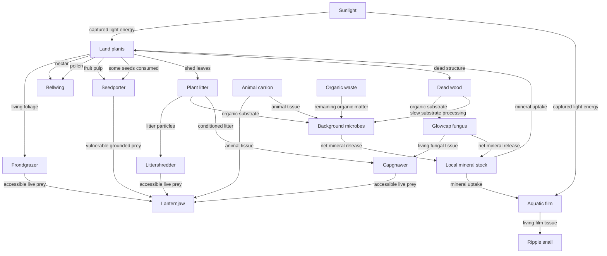

# A living mosaic: a theoretical biosphere for 3D Cubarium

I propose a small, sun-powered community arranged around a wetland edge: open
flower patches, a broken canopy, damp deadwood, dry rock gardens and shallow
aquatic growth. Its characteristic event is a change in one place creating an
opportunity somewhere else. A grazer opens a clearing; a shrub fruits there; an
animal carries its seed across a channel; the resulting shade changes who can
grow below it. A dead tree continues to matter as shelter and fungal food.

The eventual palette is ten sessile roles and seven animal roles. **That is a
library of possible communities, not seventeen populations every world must
maintain.** Several smaller combinations should work independently. Predators,
pollinators and elaborate symbioses are additions to an already functioning
world, with benefits and costs that remain observable.

Two recurring words: **sessile** means attached or rooted in place;
**propagule** means a dispersing start to a new organism, such as a seed, spore
or viable fragment. When I call growth or reproduction “paid,” I mean its
material and energy are actually withdrawn from existing resources. It is
biological accounting, not a proposed game currency.

This is a teaching proposal, not accepted canon or a report of a successful
simulation. It follows the [handoff](handoffs/theoretical-biosphere-2026-09-16.md),
with Wrysk's explicit invitation to propose additions to the substrate. Descriptions
of existing capabilities use that handoff and the linked
[voxel sketch](voxel-ecology-sketch-2026-09-16.md),
[terrain proposal](terrain-and-ecosystem-proposal-2026-09-16.md),
[diet reconsideration](ecological-niches-reconsideration-2026-09-15.md) and
[accounting contract](ecology-v1-contract.md). They are a documented baseline,
not a new code audit. The sketch predates some capabilities listed in the handoff;
where they differ, I use the handoff's later baseline. Research already collected
in [the local foundations](7_Research/terrain-ecology-foundations-2026-09-16.md)
informed the literature search. Research findings are cited below; the invented
organisms, proposed mechanisms and predictions are our design hypotheses.

## 1. Energy and gradients: what pays for a living world?

### Energy flows through; nutrients circulate

A plant is a converter. Photosynthesis uses light to build energy-rich organic
matter from carbon dioxide and water. Mineral nutrients supply necessary elements
such as nitrogen and phosphorus. Sunlight cannot replace those elements, and
fertilizer cannot replace sunlight. Animals obtain both food energy and body
materials by eating. Fungi also eat organic matter; being stationary does not
make something a plant.

Organisms spend acquired energy on staying alive, moving, building tissue and
reproducing. Respiration dissipates usable chemical energy as heat. Nutrient
atoms remain in bodies, waste, dissolved material or dead matter until another
organism takes them up, or they cross the world's boundary. A closed nutrient
cycle therefore still needs an ongoing energy supply.

Two useful terms are **gross primary production**, the energy fixed by
photosynthesis, and **net primary production**, what remains after producers'
own respiration. Even net production is not all animal food: some becomes
inaccessible wood, roots, reproductive investment or tissue that herbivores
cannot reach. This distinction will determine how many animals are affordable.

For the initial biosphere, sunlight is the only biological energy input. Keep
the existing geometric sky visibility and canopy shading, but ensure multiple
stands do not each claim the same intercepted light. Presentation brightness
need not equal ecological irradiance. A visibly bright scene can represent a
dim understory, provided growth responds to the latter consistently.

The existing generic material ledger is a useful abstraction, but it must not
teach that respiring a kilogram of wood produces a kilogram of fertilizer.
I recommend separating organic matter/chemical energy from the amount of a
limiting mineral nutrient. Initially, fixed nutrient contents per tissue type
and a buffered atmospheric carbon-dioxide supply are sufficient; no atmospheric
fluid simulation is needed. Record carbon uptake/release if claiming carbon
conservation. A single mineral currency remains an explicit simplification:
enrichment experiments show that nitrogen and phosphorus can both limit
production, including joint limitation. [Elser et al., 2007](https://doi.org/10.1111/j.1461-0248.2007.01113.x)

### Geography creates opportunities and exclusions

The stated strip is about 32 m around, 6 m deep and 12 m high. Those dimensions
do not provide mountain climates or continental migrations. They do provide
shade, rooting pockets, wet hollows, exposed shelves and obstacles. A **niche**
is an organism's way of meeting its needs under those conditions, including its
effects on others. It is more than a preferred address.

| Community | Conditions that select it | Main opportunity and limitation |
| --- | --- | --- |
| Open terrace and meadow | Strong light; aerated soil; intermittent available pore water; accessible low foliage | Rapid growth after wetting, interrupted by drying, grazing and eventual shade |
| Moist grove and its edge | Deeper rooting space; reliable moisture without persistent root suffocation; canopy gaps | Long-lived structure and shaded understory; competition for light and water |
| Deadwood hollow | Located wood/litter; moisture; attachment surfaces; often cover | Decomposition continues after leaves stop growing; finite substrate and drying limit it |
| Spring margin and shallow basin | Contiguous shallow water or saturated soil; sufficient light; access to local mineral stock | Aquatic film and flood-tolerant emergents; drying, deep submergence and later oxygen shortages |
| Rocky ridge and crevices | Small soil pockets; low water storage; open sky; interrupted access | Slow, persistent plants and refuges; little sustained food production |

These are predicates on actual conditions, not biome labels that grant bonuses.
A soil pocket on an upper ledge may support a moist community if it retains
water. A low hollow beneath dense shade may support decomposition but little
photosynthesis. Distance from the front glass has no ecological meaning by
itself; cover, light and reachable paths do.

There is a particularly valuable distinction to add: **water availability is
different from root aeration**. Roots need oxygen for respiration. Waterlogged
soil can suffocate a plant before its leaves go underwater. Flood-tolerant plants
have traits that improve internal aeration, conserve energy or escape shallow
submergence. The appropriate strategy depends on flood depth and duration.
[Colmer & Voesenek, 2009](https://www.publish.csiro.au/FP/pdf/FP09144)

Our first approximation can be a root-zone stress state that accumulates during
saturation and relaxes after drainage, with species-specific tolerance. That is
an aeration proxy, not a measured oxygen concentration. It gives reeds a reason
to replace meadow plants in flooded soil without declaring that every wet site
is good for every moisture-loving plant.

A second distinction is rapid return versus persistence. Wright and colleagues
found coordinated leaf traits spanning fast to slow returns on investment
across thousands of plant species. This supports designing a few connected
trade-offs, rather than giving every plant independent maximum growth,
durability and tolerance. [Wright et al., 2004](https://pubmed.ncbi.nlm.nih.gov/15103368/)

For Cubarium, a fast meadow plant spends readily on short-lived leaves; a dry
cushion commits more to durable tissue and reserves. The cushion loses a growth
race on a reliably moist terrace but survives dry periods the meadow plant
cannot. Those particular allocations are proposals, not numbers from the paper.

## 2. The web: several routes from sunlight to animal life

A **guild** is a group using resources in a similar way. Our guilds form three
main pathways: living plant tissue, plant reproductive products, and dead
organic matter. Aquatic growth supplies an additional spatially distinct route.
Their consumers sometimes become prey, but no single predator connects every
meal to every other meal.

In this diagram, arrows point from the resource source to its recipient. Labels
identify what moves. The two mineral-return arrows summarize several recycling
processes; they do not mean every consumed nutrient is immediately released.



All organisms eventually contribute remains, and consumers produce waste; those
repeated arrows are omitted for readability. Fungal remains retain their
identity for recycling. Mineral excretion can return nutrients without first
becoming an edible waste pile. Snails and airborne bellwings are outside the
initial hunter's accessible prey set; a death still transfers their bodies to
carrion. This is deliberate limited connectivity, not invulnerability to hunger
or environmental stress.

### What each resource means

| Resource identity | Proposed consumers and exclusions | What the transfer changes |
| --- | --- | --- |
| Living foliage/shoots | Frondgrazer; no animal automatically eats every producer equally | Removes photosynthetic area; protected roots/structure and finite reserves may permit recovery |
| Aquatic film tissue | Ripple snail; terrestrial browser excluded by mouth and access | Leaves a visible cleared feeding track on a wet support |
| Nectar | Bellwing; negligible building nutrient compared with pollen | Pays activity; does not by itself supply a complete growth/reproductive diet |
| Pollen | Bellwing, consuming some while transporting a different surviving fraction | Supplies nutrients; consumed grains cannot also fertilize flowers |
| Fruit pulp | Seedporter; no foliage-digestion fallback | Rewards travel; the attached seed remains a separate material package |
| Seeds/propagules | Seedporter destroys some; others survive carriage or remain in the seed bank | Destroyed seeds feed the animal; intact seeds retain their own paid reserves and can establish |
| Plant litter | Littershredder, microbes, and capgnawer at lower throughput after conditioning | Moves/fragments material; microbial work changes accessibility while spending energy |
| Dead wood | Glowcap plus slow background decomposition; no initial animal directly digests sound wood | Stores material, supplies fungal growth and persists as a physical object |
| Living fungal tissue | Capgnawer; shredder does not get free fungal specialization | Reduces fungal biomass or reproductive structures; spores carried incidentally are debited separately |
| Living animal tissue | Lanternjaw, constrained by prey size, encounter, reach and handling | A successful attack transfers actual tissue; unconsumed parts become finite carrion |
| Carrion | Lanternjaw and background decomposers; no generic leaf/litter consumer entitlement | A temporary subsidy with declining stock; cannot sustain an obligate scavenger without continuing mortality |
| Organic waste | Background decomposers; other consumers only if later given explicit capability | Contains unassimilated material and residual energy, never a freshly charged copy of the meal |
| Mineral nutrient | Producers and growing microbes/fungi | Builds tissue; is not animal food energy |

The dietary exclusions make places matter. A frondgrazer stranded in a clearing
full of rotten leaves can still starve. A seedporter can be surrounded by green
foliage and fail because there is no fruit or seed. A bellwing receiving sugar
but no nutrient-bearing pollen may fly for a while without producing viable
offspring. Such failures should be understandable from an optional inspection
view, not presented as mysterious hidden rules.

Broadening a gut must divide a finite investment or throughput budget. Use one
clear cost first: allocating more digestive capacity to a secondary resource
reduces processing capacity for the primary one. Add locomotor or maintenance
costs only if that simpler trade-off fails to express the intended biology.

### Decomposition is an active food pathway

A brown leaf contains chemical energy that many animals cannot extract well.
Microbes can make some material easier to consume and manufacture useful
compounds, but their own respiration spends part of the available energy.
Anderson and colleagues explicitly model this quality-versus-quantity trade-off
for marine detritivores. That setting does not calibrate a terrestrial shredder,
but it demonstrates why conditioning must not recharge food.
[Anderson, Pond & Mayor, 2017](https://www.frontiersin.org/journals/microbiology/articles/10.3389/fmicb.2016.02113/full)

Our proposed implementation abstraction is one local microbial biomass pool,
remaining substrate energy, and a small processing/conditioning state. Fungal
biomass is separate because animals eat it and the viewer sees its fruiting
bodies. Microbes and glowcaps compete for the substrate they share: both must
withdraw from the same stock. The animal never receives the entire original
leaf's energy plus a newly created microbial meal.

Keep a slow background route for litter, wood, carrion and waste. Removing
glowcaps should leave more persistent logs and reduce fungal food; it should not
permanently stop every nutrient from returning. Background decomposition needs
substrate, suitable conditions and an initial microbial inoculum. It is not
free fertilizer or an invisible animal feeding subsidy.

### The network beyond eating

The canopy changes light and cover. Logs obstruct paths and shelter small
animals. Grazers remove foliage and expose establishment sites. Reeds add cover
at the shoreline. Later, litter retention, burrows and root structure can change
infiltration. These are examples of organisms modifying other organisms'
physical environment, the central idea of **ecosystem engineering**.
[Jones, Lawton & Shachak, 1994](https://www.caryinstitute.org/sites/default/files/public/reprints/Jones_et_al_1994_Organisms_as_Oikos_69_373-386.pdf)

Seed carriage and pollination need actual transfers. A seedporter carries an
existing seed to a new support face. Its success is measured by establishment
and eventual descendants, not distance travelled: real seed-dispersal research
distinguishes the quantity moved from the quality of the eventual recruitment
opportunity. [Schupp, Jordano & Gómez, 2010](https://doi.org/10.1111/j.1469-8137.2010.03402.x)

Likewise, a bellwing moves compatible pollen between flowers, changing the
fraction of a plant's already affordable reproductive investment that becomes
viable seed. Flowers can retain a lower-output selfing or local reproduction
route. Pollinator loss then has a large consequence without instantly ending
the entire biosphere. These particular fallback rules are design choices.

## 3. Cycles, disturbance and ecological memory

### Closing the loops honestly

The nutrient loop is local mineral stock → living tissue → waste/remains →
decomposer biomass and mineral release → new tissue. Nutrients may remain tied
up in wood, animals, microbes or dormant seeds for considerable time. A globally
conserved inventory can therefore coexist with a locally starving plant.

Microbes can temporarily **immobilize** nutrients—hold them in their bodies—
while processing nutrient-poor material. Later release is **mineralization**.
For our model, fixed tissue requirements already allow this: new microbial
biomass needs nutrients, and excess released from consumed tissue returns to
the local pool. Avoid turning all microbial activity into an immediate positive
plant-growth bonus. A detailed nitrogen cycle can wait.

In the prescribed-weather baseline, water storage changes by external rain and
recharge, minus evaporation, transpiration and outlet discharge. Infiltration,
spring discharge and seepage are internal transfers. Do not count saturated
soil water again as aquifer water. Groundwater and surface water are connected
stores; the water table is a boundary of saturation, not a second kind of water.
[USGS, Circular 1139, Box A](https://pubs.usgs.gov/circ/circ1139/htdocs/boxa.htm)

For sustained aquatic habitat, average recharge must replace its losses, or
storage eventually declines. A spring can buffer a dry spell without lasting
forever. The initial water cycle is intentionally open. A later finite atmosphere
can recycle evaporated water, with external energy still driving that cycle.

Water currently carries no nutrient. Consequently, the first land biosphere
can retain its nutrient inventory while exporting pure water, but it cannot
claim realistic leaching or downstream fertilization. Once solute transport is
added, exported nutrient needs a named replacement—finite weatherable stock,
external inflow or a player addition—or long-term fertility falls. Recycling
within the world cannot replace material lost from it.

### Succession has several possible outcomes

**Succession** means a community changes after colonization or disturbance.
Early inhabitants may help successors, tolerate them or prevent their arrival.
Connell and Slatyer distinguish these mechanisms; succession is not inevitably
a march toward one ideal forest. [Connell & Slatyer, 1977](https://doi.org/10.1086/283241)

Our hypotheses for this terrain are:

| Disturbance | Immediate consequence | Proposed recovery or alternative outcome |
| --- | --- | --- |
| Dry spell lowers the water table | Shallow-rooted plants lose water; aquatic area contracts; litter processing slows | Deep-rooted survivors and paid dormant propagules recolonize after rain; a long drought can eliminate the local wet community |
| Sustained rain floods a terrace | Root aeration worsens before all shoots submerge; terrestrial animals lose routes | Reeds gain relative advantage; draining exposes establishment sites; burial/scour requires additional transport mechanisms |
| Canopy stand dies | A gap admits light; wood and foliage enter different dead pools | Flowers or turf recruit, fungi use the log, shaded groundcover retreats locally; surviving neighbours may close the gap |
| Browsers repeatedly open a patch | Leaf area and reproductive surplus fall; light reaches smaller plants | Protected basal growth can support a grazing lawn; excessive removal exhausts reserves and leaves a bare gap |
| A later burrow collapses | A shelter/path disappears; some material moves and may bury shoots | Animals find other cover and plants colonize exposed soil; this requires paid excavation and material relocation, not a random “collapse” event today |

Whole-world weather can still generate different outcomes because soils,
rooting depth and water storage differ. Do not schedule a calamity merely to
keep diversity high. First see what ordinary growth, mortality and water
variation do. No fire regime is needed without fuels, ignition and a reason for
the game to include it.

Dormancy is especially valuable. A seed bank is a population waiting through
bad conditions, not new life generated when a patch looks empty. Seeds are
parent-paid packages, age and die, and germinate only under appropriate
conditions. Research on desert annuals connects persistent stages and different
responses to variable conditions with coexistence through the **storage
effect**. Dormancy alone does not establish that mechanism; the species must
also differ in how environment and competition affect their success.
[Angert et al., 2009](https://pmc.ncbi.nlm.nih.gov/articles/PMC2710622/)

Here, propose several wet/dry episodes of seed survival, not immortality. A
failure to leave any survivors or viable propagules is an actual local loss.
Recolonization needs a route from another patch or an explicit introduction.

### Keystone, foundation and redundancy

A **keystone** has an effect unusually large relative to its abundance. It is
not a synonym for predator or important organism. A canopy species may instead
be a dominant habitat-forming foundation. We would establish a keystone claim
by manipulating its abundance and measuring consequences.
[Power et al., 1996](https://www.umt.edu/mills-lab/files/2015/01/powerchallenges96.pdf)

Lanternjaw is a candidate if a small predator population prevents browsers from
excluding several plants. Seedporter could qualify if it connects otherwise
isolated groves. Neither is guaranteed that role. Removing a log fungus might
strongly alter a hollow while barely affecting the meadow.

Redundancy should be partial: multiple producers, background recycling,
surviving plant reserves and occasional local seed dispersal. This keeps loss
from switching every process off while preserving differences worth watching.
Predator-free and pollinator-free communities must remain possible.

## 4. The palette: organisms as ecological hypotheses

The following names are provisional. “Stand” means the photosynthetic body can
be expressed through the handoff's foliage/structure/reserve model and traits.
“Animal” means compatible with its proposed body/diet/lifecycle approach; voxel
animals still need rebuilding. Neither label claims the whole role ships today.
Anything after “+” is an additional mechanism. Mechanism names match §6.

At four pixels per voxel, distinguish roles first by silhouette, size and
feeding motion. Use small colour accents to reinforce identity, with bounded
variation for descendants. A changing patch edge, cropped tuft, occupied log
or scrape trail should reveal the interaction even when individual mouthparts
are too small to see. These are readability requirements, not finished art.

All producers require light, carbon supply, water and mineral nutrient; none
eats light as a material. All reproduction is paid. All deaths retain remaining
matter and energy in the appropriate resource pool.

### Ten sessile roles

| Role and inputs | Terrain niche | Life history, reproduction and dispersal | Death and visible removal effect | Readable form; model fit |
| --- | --- | --- | --- | --- |
| **Bloomcrown:** photosynthetic meadow pioneer | Sunny, shallow aerated soil; establishment after wetting | Quick foliage and reproduction; local paid seeds; later nectar/pollen and a finite seed bank | Drying, prolonged shade or repeated stripping → litter and small dead structure; removal loses bright pulses and much bellwing food | Upright flowers with one warm accent; **Stand + reproductive products, dormancy** |
| **Umbrellafrond:** photosynthetic moist understory | Moist rooting pockets; tolerates shade, not darkness or long waterlogging | Slower turnover; reserve-supported recovery; local paid propagules | Dry root zone or unpaid maintenance → litter/wood; removal exposes damp ground and reduces shade-associated browsing | Broad low umbrellas; **Stand**, improved by aeration response |
| **Springturf:** photosynthetic grazing lawn | Lit, reliably moist but drained open ground | Low foliage; strong allocation to protected basal structure/reserve; short clonal spread; less investment in height | Exhausted reserves, drought or canopy closure → litter; removal makes grazed clearings less productive | Dense short tufts and visible cropped margins; **Stand**, using low crown and reserve traits, no separate regrowth bonus |
| **Stonecushion:** photosynthetic dry-site persister | Thin soil in exposed rock pockets; low water storage | Slow growth, durable leaves, substantial reserve; few local propagules after rain | Prolonged drought or shading → persistent small remains; removal leaves dry shelves empty for longer | Compact pale mound; **Stand**; true drought dormancy would be additional |
| **Velvetpad:** photosynthetic shelter carpet | Thin damp soil under ledges with lateral light; low crown-height opportunity | Very low structure and turnover; close local spreading; poor competitive height | Drying or complete darkness → fine litter; removal loses a low green layer and tiny cover | Flat cool-green patches; **Stand** for moist-soil analogue, **+ surface hydration** for real moss-like rock colonization |
| **Vaulttree:** photosynthetic canopy builder | Deep, aerated soil with enough water; establishment needs a gap | Slow costly structure; long life; local seeds; reserve buffering | Drought, saturation stress or senescence → located log and litter; removal opens a large light gap and removes shelter | Sparse branching vault, crown gaps; **Stand + structural log/cover effects** beyond existing shade |
| **Lanternberry:** photosynthetic fruiting shrub | Grove edges and moist bright gaps; less shade tolerance than frond | Repeated paid fruit crops after reserve recovery; local drop or seedporter transport | Shade or drying → wood/litter and finite fallen fruit; removal interrupts animal travel between feeding patches | Mid-height shrub with distinct hanging fruit; **Stand + reproductive products, seed carriage** |
| **Siphonreed:** photosynthetic emergent | Saturated soil and shallow standing water; shoots reach light/air | Invests in internal aeration at an allocation cost; local paid spread; water-carried seed later | Drying or prolonged deep submergence → tough litter; removal opens shoreline cover | Narrow upright stems in coherent clumps; **Stand + aeration response**; hydraulic obstruction later |
| **Glassfilm:** photosynthetic attached aquatic mat | Lit, shallow, continuously wetted supports with a funded nutrient route | Rapid tissue turnover; short paid fragment spread; no survival in permanent darkness | Drying, grazing or deep shade → aquatic organic residue; removal loses the snail's food and wet-surface colour | Thin green-gold coating with scrape trails; **+ aquatic producer metabolism/access**, including underwater light and nutrient uptake |
| **Glowcap:** heterotrophic wood fungus | Moist dead wood; no photosynthetic requirement; aerated attachment | Substrate-fed mycelium; paid fruiting caps and spores; short dispersal, animal carriage later | Food exhaustion, drying or grazing → fungal remains; removal leaves logs longer and removes capgnawer food | Clusters attached to identifiable logs, restrained luminous caps; **+ fungal metabolism, substrate consumption, paid glow** |

Velvetpad is deliberately a moist-soil analogue initially. Calling it “moss”
does not grant the ability to drink atmospheric humidity or grow on clean rock.
Glassfilm likewise requires an explicit water/nutrient route; simply choosing
high flood tolerance on a terrestrial plant is insufficient.

The two superficially similar small plants, springturf and bloomcrown, differ
in allocation and regeneration position: one keeps producing low accessible
leaves under intermittent browsing; the other invests in height and reproductive
structures. Velvetpad instead competes where those plants cannot pay their
maintenance in low light. If those differences fail to create distinct
opportunities in practice, merge roles rather than adding unexplained bonuses.

### Seven animal roles

Each role pays adult maintenance and juvenile growth, and transfers offspring
material through the shared reproductive budget. Founders need a viable mating
system and enough partners; a single sexually reproducing specimen is not an
established population. Do not add a special unpaid larval food source.

| Role and food identity | Terrain/access needs | Life history, reproduction and dispersal | Death and visible removal effect | Readable form; model fit |
| --- | --- | --- | --- | --- |
| **Frondgrazer:** tender foliage, especially turf and bloomcrown; tougher frond at lower throughput | Walkable routes and reachable low foliage; limited wading; shelter within travelling distance | Moderate reserves; births after sustained surplus; juveniles eat accessible leaves; walks between patches | Starvation, predation, drowning → carrion; removal permits taller/denser foliage and fewer grazed gaps | Low broad body, deliberate cropping pauses; **Animal + voxel access/motion** |
| **Seedporter:** fruit pulp and some seeds; no leaves, wood or carrion | Fruit-bearing edges, climbable structure and safe landing routes | Costly movement with more feeding yield per fruit visit; paid young on same resource class; survives short fruit gaps from reserve | Starvation or exposed-ground predation → carrion; removal slows colonization across obstacles | Long tail or carrying posture, conspicuous feeding trips; **Animal + climbing, seed payload**, gliding optional later |
| **Bellwing:** nectar for energy and pollen for nutrients | Reachable flowers in more than one patch; sheltered resting sites | Small body, costly flight and frequent rest; paid young use the same abstract diet initially; no implicit metamorphic diet switch | Flower shortage, weather exposure or starvation → carrion; removal reduces outcrossed seed production | Hover–land–sip rhythm, paired wings; **Animal + flight, pollen carriage, food composition** |
| **Littershredder:** plant litter, including coarse fragments; not carrion or sound wood | Damp litter on traversable ground; low cover; poor exposed-rock tolerance | Low power, modest surplus-dependent reproduction; short walking dispersal; processes rather than globally redistributes litter | Drying, predation or depletion → carrion; removal leaves thicker coarse litter and slower processing | Segmented body with stop-and-shred motion; **Animal + litter fragmentation**; burrowing optional |
| **Capgnawer:** fungal tissue; conditioned litter as a weaker fallback | Moist logs and nearby conditioned litter; small crevices | Slow enough reproduction to follow fungal renewal; local movements between logs; offspring consume same resources | Fungal depletion, drying or predation → carrion; removal leaves more caps and less visible fungal grazing | Rounded body, short nibbling visits to caps; **Animal + fungal food identity** |
| **Ripple snail:** attached aquatic film; no land foliage or carrion | Connected shallow wet surfaces; slow travel; later limited damp-bank crossing | Slow upkeep and maturation; paid young on film; no spontaneous appearance in new ponds | Drying, sustained food shortage and, with oxygen modelling, hypoxia → carrion; removal permits thicker film | Flat spiral or domed shell, slow cleared trail; **Animal + aquatic locomotion/respiration** |
| **Lanternjaw:** reachable small grazers, shredders, capgnawers and vulnerable grounded seedporters; carrion fallback | Broken sightlines, attackable body sizes, escape routes for prey; cannot hunt everywhere | Low resting demand, costly attacks/handling; reproduction follows sustained prey surplus; juveniles require smaller suitable prey | Starvation, failed recruitment or flooding → carrion; removal may release browsing and alter prey use of clearings | Compact ambusher with long stillness and brief strikes; **Animal + voxel cover, reach and hunting** |

Capgnawer and littershredder have some overlap, not identical diets: fresh coarse
litter versus fungal-rich wood patches should support different performance.
Their coexistence is a question to test. Lanternjaw is a small invertebrate-like
predator in energy demand, not a miniature wolf requiring a mammalian food
budget. Its glow, if retained, also costs energy; predation needs no magical lure.

Glowcap offers a research-grounded alien flourish. Experiments with luminous
mushroom models attracted more insects than dark controls. That supports trying
a light-mediated encounter mechanism, but does not establish that our fungus
will gain more surviving descendants. [Oliveira et al., 2015](https://pubmed.ncbi.nlm.nih.gov/25802150/)
Charge the glow to fungal reserves; let an attracted capgnawer both damage caps
and potentially carry paid spores. Display amplification of that faint light
need not feed simulated photosynthesis. Whether the interaction is beneficial
must emerge from recruitment relative to the cost and damage.

## 5. Why it might persist—and what would disprove that

### Coexistence requires a reason for the losing species to recover

Equalizing two species' growth rates does not ensure that both persist. Chesson
distinguishes reducing average competitive inequalities from **stabilizing
mechanisms**, which give species an advantage when they become uncommon. A
useful question is whether a population can recover from low density while its
competitors remain established. [Chesson, 2000](https://www.annualreviews.org/content/journals/10.1146/annurev.ecolsys.31.1.343)

For our two starting plants, abundant bloomcrown should increasingly compete
with other bloomcrowns for open, drying sites, while moist shaded sites still
offer umbrellafrond an opportunity. The reverse must also hold somewhere.
If umbrellafrond grows as fast in full sun, withstands the same drought and
tolerates more shade, the labels describe a likely winner and loser. Making
their initial populations equal would only delay discovery.

The proposed stabilizing opportunities are different water/light requirements,
different resource identities, different physical access, and later different
responses to wet/dry episodes buffered by reserves or propagules. Each needs
measurement; a long species table does not demonstrate coexistence.

Space must permit both survival and return. Several productive patches with
partial barriers are more useful than one uniform lawn or completely isolated
islands. Most plant recruitment can remain within a few neighbouring supports,
with occasional paid longer transport. Animal travel between food patches
should cost a meaningful fraction of its feeding/rest cycle; a lap around the
strip must not automatically make every resource locally available.

The metacommunity framework already in the local research considers local
interactions, environmental differences, dispersal and chance together. That
supports evaluating patch spacing and mobility jointly, without treating one
dispersal distance as universally correct.
[Thompson et al., 2020](https://onlinelibrary.wiley.com/doi/10.1111/ele.13568)

Huffaker's classic mite experiments provide a useful caution: spatial complexity
and partial barriers prolonged predator–prey coexistence through several cycles,
but did not establish endless persistence. Our refuges likewise improve an
opportunity; they cannot guarantee immortality in a finite world.
[Huffaker, 1958](https://my.ucanr.edu/repository/view.cfm?article=152469)

At tens to low hundreds of animals, chance deaths, missing mates and synchronized
bad years matter. A role that can energetically support one adult may still be
unable to sustain a breeding population. Do not divide the animal budget among
seven species merely to fill the roster. Small worlds can omit the predator,
combine overlapping consumers or support alternative community compositions.

### Production pays recurring bills; starting stock pays only once

For animal guild `g`, consider the following accounting over an interval long
enough to include feeding, resting and reproduction:

```text
assimilated energy = sum over food identities (actual intake × usable yield)

surplus = assimilated energy − maintenance − movement/handling costs

surplus funds growth, reserve accumulation and reproduction
```

Intake must satisfy both the mouth's capacity and the continuing production of
food the body can actually reach. Animal tissue production also needs enough
assimilated nutrients. A sugary diet can cover movement while failing that
second requirement. Stored reserves postpone a deficit; they do not erase it.

Here is a deliberately rounded teaching example, **not a calibration or a
recommended efficiency**. Suppose net plant production is of order one hundred
energy units per interval. Only a few tens may enter renewing foliage reachable
by the browser; the rest follows other allocations. Digestive losses and the
browser's recurring expenses can leave only a few units for new animal tissue.
The hunter must live on the reachable fraction of that much smaller production,
while leaving enough surviving prey recruitment to replace losses. A large
standing herd does not establish that its current birth rate can pay for hunting.

The relevant carrying capacity is thus conditional on productivity, access,
body costs, competitors and weather. It is not a fixed species quota, and there
is no universal ten-percent transfer rule to impose here. Similarly, carrion
and litter already present at initialization must be reported separately from
material produced by the living community during the study.

Useful ratios to inspect before searching parameters are:

| Ratio or ordering | Why it matters |
| --- | --- |
| Renewable accessible food / actual consumption | Sustained consumption above renewal liquidates the food stock; below renewal is necessary but does not ensure successful foraging |
| Reserve-supported fasting time / time between reachable meals | Detects a travel or seasonal gap that averages conceal; measure adults and juveniles separately |
| Consumer recruitment time / recovery time of a grazed patch | Recruitment much faster than recovery can build demand that arrives after the surplus has disappeared |
| Seed survival time / interval between establishment opportunities | Dormancy helps only if paid seeds can survive until a suitable opportunity occurs |
| Patch recolonization time / interval between local losses | Too-slow rescue strands suitable habitat; very rapid mixing can erase spatial differences |
| Nutrient release / nutrient immobilization and export | Identifies a recycling bottleneck even when total organic matter is large |

As an initial time hierarchy, make an ordinary feeding visit shorter than local
leaf recovery, and recovery shorter than large structural replacement. Woody
turnover can be roughly one or two orders of magnitude slower than soft foliage
turnover, so a log records history. Let reproduction require multiple successful
feeding episodes and juvenile development, rather than one unusually good bite.
These are prototype choices to compare, not natural constants. Avoid arbitrary
real-time days until the resulting rhythms are enjoyable to observe.

More resources do not guarantee more stability. Rosenzweig's consumer–resource
models show enrichment destabilizing equilibria under their assumptions. That
is a warning to examine overshoot and feedback, not a claim that fertilization
always causes collapse. [Rosenzweig, 1971](https://pubmed.ncbi.nlm.nih.gov/5538935/)
Likewise, weak-to-intermediate feeding links can damp oscillations in food-web
models, but “add more omnivory” is not a universal repair.
[McCann, Hastings & Huxel, 1998](https://www.nature.com/articles/27427)

For Cubarium, keep the hunter's access incomplete and its handling finite. Its
secondary carrion diet should reduce waste when a carcass exists, not supply
constant free maintenance. A generalist hunter subsidized by abundant shredders
could still eliminate a rare browser. More food channels can connect risks as
well as buffer them.

### Candidate minimum communities, and the build order

“Viable” below means theoretically capable of continuing under suitable input
and trait regimes, not already demonstrated. Every row includes finite starting
mineral stock, funded founders, ongoing light/water as required, and background
recycling. No row requires every previous optional branch.

| Order/branch | Smallest useful standalone community | What it can demonstrate without later roles |
| --- | --- | --- |
| **0: producer duet** | Existing bloomcrown + umbrellafrond + background microbes | Geography, paid recruitment and nutrient return; each producer may also sustain a simpler one-species patch on suitable terrain |
| **1: grazed meadow** | A renewable low producer, initially bloomcrown or springturf + frondgrazer + microbes | Complete animal generations paid by accessible leaf renewal; no predator needed |
| **2: decomposer grove** | A woody producer + glowcap + background microbes | Continuing wood production funds decomposition; a fungus placed on one log alone is a finite-stock experiment |
| **3: fungal consumer branch** | Community 2 + capgnawer | A consumer supported through the wood–fungus route; conditioned-litter fallback is optional, not necessary to claim this branch |
| **3: litter branch** | A litter-producing plant + littershredder + microbes | Litter renewal and processing support an animal without carrion or fungal caps |
| **4: shallow-water branch** | Glassfilm + ripple snail + aquatic recycling and a local nutrient route | A complete short aquatic web; neither reeds nor fish are necessary |
| **5: dispersal branch** | Multiple lanternberry stands + seedporters + microbes | Paid fruit production sustains movement and some carried seeds recruit; asynchronous crops/reserves must actually bridge food gaps |
| **5: pollination branch** | Multiple bloomcrown stands + bellwings + microbes | Nectar plus pollen support complete generations; pollen transfers change viable seed production; limited autonomous plant reproduction remains |
| **6: connected predator community** | Productive meadow + litter branch + their consumers + lanternjaw | Predation, refuges and cross-channel effects; add only where measured prey turnover supports breeding predators and their juveniles |

Adding a visible species is not always the next step. After the producer duet,
local nutrient identity, access and propagule persistence may teach more than
another plant preset. Before bellwings or seedporters, their reproductive food
must exist as a continuing resource, not a decorative animation.

### The first experiment I would run

Run one small **recovery-and-renewal study**, beginning with the existing two
producers and background recycling. Use a few matched terrain seeds and the
same prescribed wet–dry–wet input. Compare a plant-only arm with an arm that
adds a small, fully paid browser cohort once plants establish. Before voxel
animals exist, a bounded experimental harvest of reachable foliage can test
only the producer response; it cannot establish animal viability.

Start with little or no edible dead matter beyond declared founder/inoculum
packages, and permit no ongoing feed additions. After a baseline, reduce each
producer in a small suitable patch in turn, moving removed tissue to its normal
dead pool. Track whether its own descendants recover there or recolonize it,
and whether the other plant excludes it. That is a practical recovery probe,
not a proof of community-wide stability.

Observe production versus consumption by resource, reserve trends, location of
recruitment, and descendants that themselves reach reproductive age. Inspect
the browser's actual accessible food when it fails. If necessary, compare with
a diagnostic controller using the same paid body, sensing and movement limits
to distinguish a poor policy from an impossible food budget.

This study is most informative if it falsifies something: a producer never
recovers despite suitable habitat; leaves recover only without browsing; animals
persist only while initial reserves run down; juveniles cannot reach their food.
Each result identifies a smaller problem than “the whole web died.” Success
supports this basal module, not all seventeen roles. Measure throughput first
and bound the study; if automated, it belongs in an explicitly invoked study,
not the routine fast test suite. No such experiment was run for this report.

## 6. Requests to the substrate

These are requests for future simulation work. They do not change the terrain
or water system in this task. Priorities follow ecological dependencies, not
the novelty of the feature.

| Capability | Why this biosphere needs it | Smallest useful version and timing |
| --- | --- | --- |
| **Separate organic matter/energy from limiting mineral content** | Food can be energy-rich but poor for building bodies; wood is not mostly fertilizer; nutrients can be immobilized | One limiting mineral, fixed tissue requirements, buffered CO2 boundary. Preserve a named generic-material approximation until replaced. Address before teaching nutrient-specific gameplay |
| **Local resource identity and microbial processing** | Leaves, wood, carrion, fungi and waste support different bodies and turnover times | Stocks attached to support faces, bounded shared withdrawals, implicit microbial biomass and a conditioning state. Before the decomposer/consumer web |
| **Root-zone aeration response** | Wet roots can fail without visible shoot submergence; reeds need a meaningful advantage | Saturation-duration stress and drainage recovery, with paid tolerance traits. Before claiming a credible wetland community |
| **Paid dormant propagules** | Recovery after drought or local loss needs stored living potential | Local cohorts by identity, amount, viability/age and germination conditions; finite attrition. Add early; do not preserve immortal frozen “establishing” packages |
| **Geometric feeding access and refuges** | Food above reach does not feed a ground browser; cover changes encounters | Standable supports, bounded travel, mouth reach, body-sized passages and line of sight. Required when animals enter the voxel world |
| **Non-photosynthetic stand metabolism** | Glowcaps must grow by consuming actual wood, maintaining mycelium and paying for caps/spores | Reuse stand location/lifecycle structure, replace income and substrate rules. No light income. Before adding glowcaps |
| **Reproductive products and payloads** | Fruit, pollen, nectar and seeds perform different jobs | Debit plant allocation; separate edible reward from surviving seed/pollen; carriage with finite retention and loss. Before mutualist animals |
| **Aquatic producer access** | Film requires underwater light, appropriate carbon/water handling and a mineral source | Lit attached mats on submerged soil with direct bounded sediment-mineral uptake. This avoids dissolved nutrient transport initially but excludes unsupported film on clean rock |
| **Aquatic oxygen availability** | Respiration and decomposition can make a pool unsuitable despite ample water | Initially restrict the snail experiment to an explicitly well-aerated shallow-water assumption. Add a pond oxygen budget for production, demand and surface exchange before claiming hypoxia/eutrophication dynamics |
| **Nutrient movement with water** | Runoff should be able to relocate fertility and outlet flow can export it | Conservative dissolved-mineral transfers on existing water fluxes; sediment/particulate transport later. Optional for land-only modules; needed for downstream-nutrient gameplay |
| **Organic cover, hydration and structural logs** | Damp litter/log habitat, rock moss and shelter need physical support | First use local soil/water contact and geometric cover; later finite surface-film water, canopy interception/drip and physically located logs. Shade alone does not imply humid air |
| **Limited soil engineering** | A shredder or future burrower can alter access, infiltration and shelter | Litter fragmentation first; later a few paid soil-relocation actions with displaced water handled. No general erosion solver required |

The current substrate is a good starting abstraction. Constant temperature,
prescribed rain and no ecological day/night are reasonable omissions. Day/night
would later add feeding-time niches and make aquatic oxygen fluctuate, but it
also adds failure modes before the basic food pathways work.

The potential modelling mistakes are more specific: letting saturation only
help plants; presenting the generic material currency as literal mineral
nutrition; granting underwater producers food or light merely for being wet;
and calling an indefinitely frozen propagule a realistic seed bank. These are
risks in carrying forward abstractions from the linked documents, not findings
from a code inspection. Likewise, a single aquifer head is a useful first model
but cannot represent independently perched water bodies unless their storage
and hydraulic connections are treated separately.

### Three optional additions worth keeping in view

**A mineral-weathering symbiosis.** A plant pays carbon to a root-associated
fungus that accesses an explicitly finite, otherwise unavailable mineral pool.
The game gains a reason to establish partnerships in nutrient-poor rock pockets.
For the first prototype, an ordinary producer plus slow weathering can stand in.
Do not advertise nitrogen fixation unless nitrogen gas and its conversion cost
exist; fixation cannot manufacture phosphorus or generic matter.

**A chemically powered spring mat.** This would make a dark seep biologically
distinct. Its energy source must be a delivered reduced chemical plus an
oxidant, with reaction products and a bounded supply. Moving water or dissolved
“minerals” alone is not enough. This is speculative alien content and a separate
geochemical extension, not necessary to rescue a photosynthetic web.

**A fungus-tending animal.** Let a later shredder carry real litter to a damp
site, process it and eat part of the resulting fungus. It pays transport and
loses some food to fungal respiration. The interesting story is an animal
constructing its own future feeding patch, with possible competition from
capgnawers. Start with observable litter relocation; do not implement an
abstract farming multiplier. These additions are design possibilities, not
claims that their detailed biology has been established here.

## 7. The game angle: learning to create opportunities

The ecological model already offers a game loop: notice a limiting condition,
change the habitat, predict a consequence and see what happens. This fits the
[existing roadmap](game-roadmap-2026-09-16.md). Progression should reveal new
relationships and choices; a fully wooded world need not be an upgrade over a
productive meadow or wetland.

Research on educational games found benefits when the learning activity was
integrated into the central game mechanic. The study concerned children's
mathematics games, so it does not demonstrate that Cubarium will teach ecology
or retain adult players. It is a useful design analogy: understanding water,
food and recruitment should help the player act successfully.
[Habgood & Ainsworth, 2011](https://eric.ed.gov/?id=EJ922627)

### A progression through relationships

Begin with soil, a feasible water supply, mineral stock and pioneer founders.
“Barren” can mean visually empty; a completely sterile, nutrient-free rock box
requires more starter inputs than two plants. Let the player establish the
producer duet, then choose a meadow, decomposer or shallow-water branch.
Mutualists connect patches later. Predators offer a different observation and
management problem once prey turnover exists; they are not the final badge of
an ecosystem being correct.

A small lesson could be: an empty terrace is sunny but too dry for a seedling.
A modest diversion wets its soil; planted descendants establish. Excess diversion
then waterlogs it and reduces the downstream pool. The player can select a
flood-tolerant plant, improve drainage or reduce diversion. One intervention
changes several real opportunities, with visible causes.

The field guide should answer specific questions when opened: “Roots have been
saturated; leaves are still above water,” “This animal can reach foliage but
cannot digest the litter beneath it,” or “Seeds arrived, but this site is too
dark for establishment.” Keep the ambient landscape free of permanent numbers.
Include resource traces and lineage history in explicit inspection tools.

### Health is a set of observations, relative to the intended community

| Observation | Encouraging evidence | Reason to investigate |
| --- | --- | --- |
| Replacement | Descendants mature and replace ordinary losses | Many births but persistent juvenile failure; only founders remain |
| Renewable support | Consumption follows current production across wet/dry episodes | Reserves, initial litter or imported feed cover a continuing deficit |
| Recovery | Suitable gaps recruit from surviving populations/propagules | Remaining habitat cannot be recolonized despite viable resources |
| Habitat variety | Different patches support different activity and composition | One consumer/resource channel erases every other opportunity |
| Recycling and water | Locally usable nutrients and water return through explainable routes | Fertility locks away, water storage drains, or inputs hide an unresolved deficit |
| Disturbance response | Losses remain local or recovery follows a comprehensible route | Ordinary small disturbances repeatedly cause irreversible world-wide loss |

These are diagnostics, not ingredients to maximize into one score. A dry ridge
can have low biomass and be functioning well; a young clearing can be bare and
recovering. Conversely, a crowded green world may be spending capital faster
than it produces food. Some turnover and local extinction belong in a living
world. “Healthy” should be shown relative to a chosen habitat/community goal.

If progression rewards reproduction, attach substantial credit to surviving
descendants and newly functioning relationships, rather than unlimited payment
per birth. A seed delivered to a suitable patch that later reproduces is a more
meaningful discovery than a thousand dropped seeds. Research points unlock
choices; actual introductions or supplies remain explicit material inputs.
The same ecological event should have the same value regardless of time speed.

### Steering evolution has trade-offs

| Player intervention | Selection or ecological effect | Real cost or opportunity sacrificed |
| --- | --- | --- |
| Create a wet corridor | Improves passage/establishment for moisture-dependent variants | Water comes from storage or another route; floods can exclude dry-ground life |
| Open a canopy gap | Favours fast light-demanding growth and changes exposure to predators | Removed tissue becomes a log/litter or a named export; shade habitat is lost locally |
| Favour deeper-rooting offspring | Can improve access during drying | More construction/maintenance allocation to roots, less to early foliage or seeds |
| Broaden a consumer's diet | Reduces dependence on one fluctuating food | Divides its digestive capacity; can also increase competition with another guild |
| Move a log or add shelter | Creates fungal substrate/refuge if conditions permit | Relocates finite material and costs work; a dry log does not become a productive fungus farm by placement alone |
| Pump water uphill | Maintains a habitat against gravity | Finite water and device power; minimum lifting work scales with mass × gravity × height |

Environmental selection changes which inherited variants leave descendants;
editing a lineage directly is a different game action. Label the distinction.
Start edits in offspring or introduced founders, consistent with the roadmap.
Do not let an unlock silently give every living adult a free new gut or deeper
roots. Faster evolutionary change is a possible artistic choice, but its
resource consequences should remain real.

For now, defer currencies, a large science tree, campaign objectives and a
general evolution optimizer. Revisit the first playable branch when one small
community completes generations on renewing resources and terrain edits produce
understandable changes. Revisit mutualist progression when seed/pollen transfers
affect descendants. Revisit predator progression when juvenile as well as adult
predators can be supported. Those are points at which there is something useful
to play with; they do not hide development controls or demand a perfectly
balanced world before experimentation.

## Reading guide and evidence limits

The links beside claims lead to the research used. This was a targeted literature
review, not a systematic review. Publisher/author papers, publicly available
abstracts and USGS material were checked; no numerical rates were imported into
Cubarium. Chesson's general framework and several classic papers were consulted
through their published summaries; detailed claims here stay within those
summaries. The roster and build sequence remain proposed applications.

For a first ecology lesson, read these in order:

1. **[Wright et al.: The worldwide leaf economics spectrum](https://pubmed.ncbi.nlm.nih.gov/15103368/).** Plants differ in how quickly their investment pays back. Use this to question an organism that seems best at everything.
2. **[Chesson: Mechanisms of Maintenance of Species Diversity](https://www.annualreviews.org/content/journals/10.1146/annurev.ecolsys.31.1.343).** Ask what lets an uncommon competitor recover, rather than only whether two populations are currently alive.
3. **[Anderson, Pond & Mayor: The Role of Microbes in the Nutrition of Detritivorous Invertebrates](https://www.frontiersin.org/journals/microbiology/articles/10.3389/fmicb.2016.02113/full).** Food quality can improve while its total remaining energy declines. Its oceanic model is an analogy, not our calibration.
4. **[Angert et al.: Functional tradeoffs determine species coexistence via the storage effect](https://pmc.ncbi.nlm.nih.gov/articles/PMC2710622/).** A field-based example connects different growth strategies, variable rainfall and persistent life stages.
5. **[Power et al.: Challenges in the Quest for Keystones](https://www.umt.edu/mills-lab/files/2015/01/powerchallenges96.pdf).** Learn why “this organism seems important” is a hypothesis that can be tested through its effects.

Three questions to carry into the next simulation: What is paying for this
organism today? What will pay for its descendants after the starting stock is
gone? If it becomes rare, what real opportunity allows it to return?
